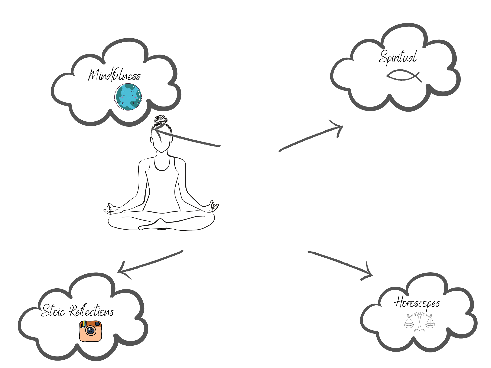
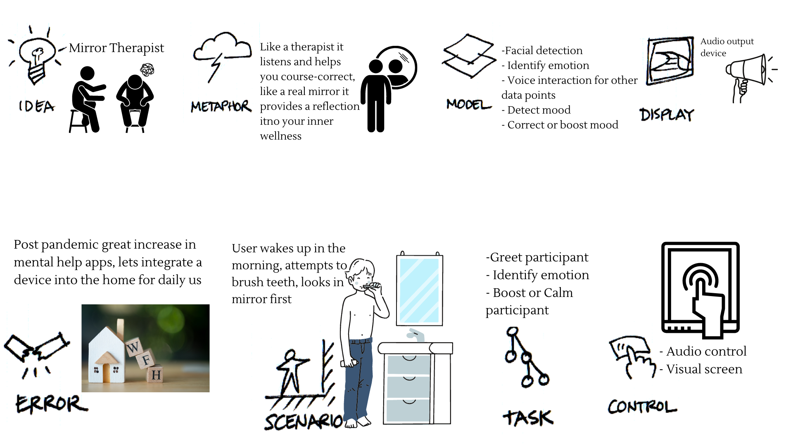
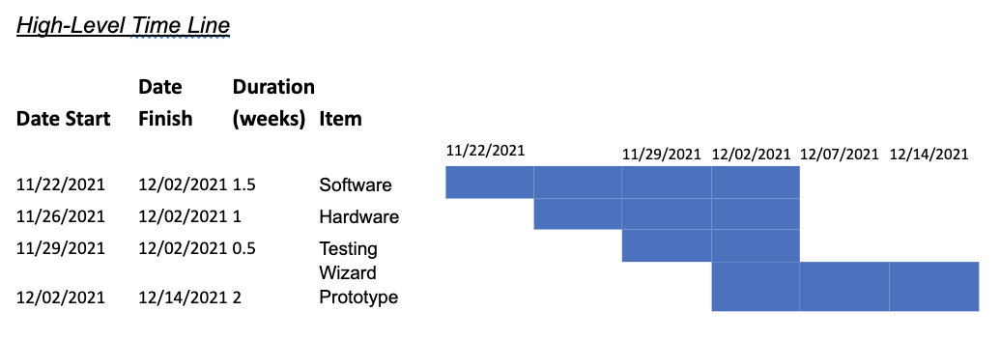
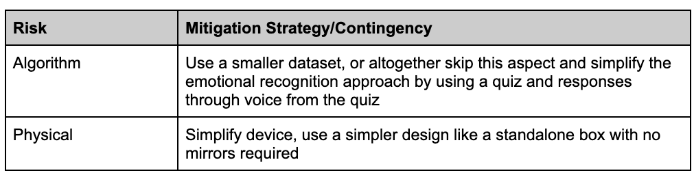
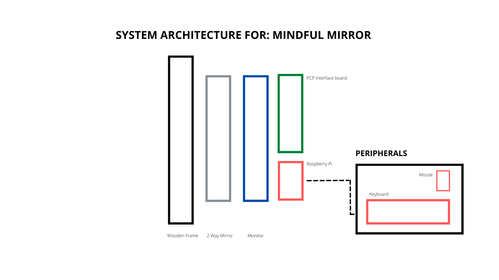
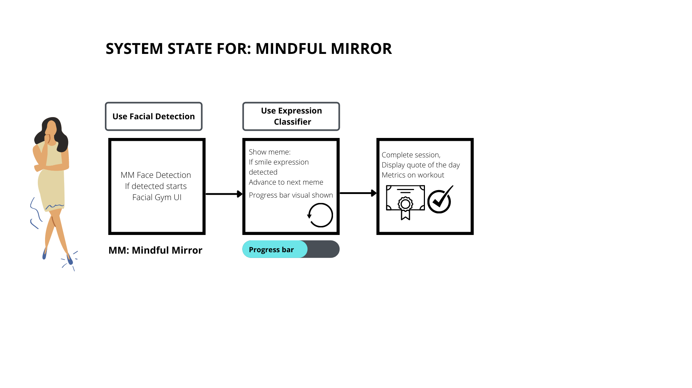
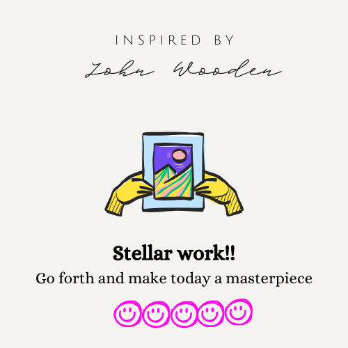
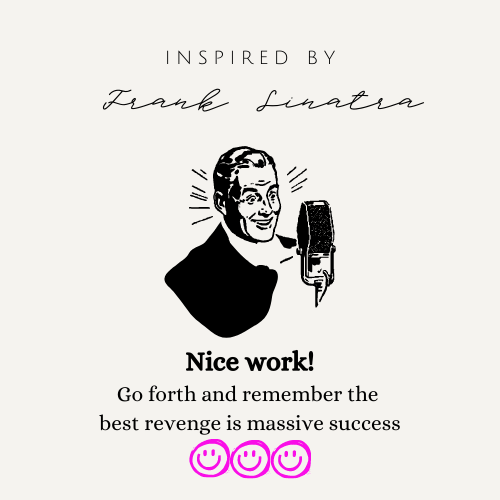
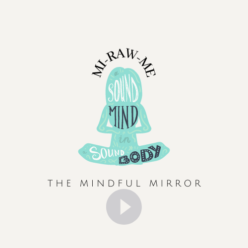

# Final Lab

# MiRawMe

This is the final lab project for the Interactive Device Design course at Cornell Tech. I will use a Raspberry Pi to build a fully functioning and well-designed interactive everyday device for the home. 

**Table Of Contents**

[Project Plan](#project-plan)

[Big Idea](#big-idea)

[Parts Needed](#parts-needed)

[Parts Needed](#parts-needed)

[Risks And Contingencies](#risks-and-contingencies)

[Final Deliverable](#final-deliverable)

[Code Base](#code-base)

[User Feedback](#user-feedback)

[Project Reflections](#project-reflections)

# Project Plan

## Big Idea

**Problem Scope**

The concept of a Smart Mirror is often used to display information such as weather details or perhaps an agenda of activities for the day. It seems apt that since you visit the mirror more than likely at least at the start of the day, then again perhaps before bedtime it creates the ideal “check in and out” point of reference for the participant. Whilst these displays can be useful for the purposes of maintaining productivity of one’s day, there seems to be greater awareness and a need for mental wellness and introspective moments in a daily routine. This is in line with a general trend towards being more isolated over the last 18 months with more opportunities to reflect or working and living from the same primary base at home.

  

The concept behind Mi-Raw-Me is to create a smart mirror that tries to reflect the self, understand its current state and then try to adjust and remedy with some directional notes/quotes or instructions.  The idea can be seen in many different cultures, religions or even lifestyle modalities such as:

- [Daily Horoscope](https://www.msn.com/en-us/lifestyle/horoscope) - being used to offer direction on the participants motivations for the day

- [Stoic Reflections](https://www.instagram.com/stoicreflections/?hl=en) - That cause the mind to be questioned, intrigued and inspired through daily online platforms like instagram

- Spiritual “[Word of The Day](https://vision.org.au/the-word-for-today/)” Reflections - That offer proverbs and wise messages with a spiritual connection

- [Mindfulness](https://www.mayoclinic.org/healthy-lifestyle/consumer-health/in-depth/mindfulness-exercises/art-20046356#:~:text=Mindfulness%20is%20a%20type%20of,mind%20and%20help%20reduce%20stress.) - Apps like [Calm](https://get.calm.com/freetrial?pid=googlesem&af_channel=googlesem&af_c_id=14966608029&af_adset_id=129804321258&af_ad_id=553574999918&af_sub_siteid=&af_keyword=calm%20app&af_sub3=e&af_sub4=Cj0KCQiA-eeMBhCpARIsAAZfxZCT5g-xfQe41GPs4-q4XCp1X4YaghZHKKjrGgpdUnWI_EiIorOHeq4aAmrgEALw_wcB&af_sub5=xx&utm_medium=paid&utm_source=googlesem&utm_campaign=gsa_b2c_us_web_desktop_brand_app_tcpa_lptest-freetrial&utm_content=/freetrial&utm_term=calm%20app&gclid=Cj0KCQiA-eeMBhCpARIsAAZfxZCT5g-xfQe41GPs4-q4XCp1X4YaghZHKKjrGgpdUnWI_EiIorOHeq4aAmrgEALw_wcB) for example offer reflections and mindful notes for the day

**The Science Behind It**

What is common across the various methods people use to self-adjust their inward self and frame of mind is the concept around positive thinking. Championed by the likes of Napoleon Hill in “Think And Grow Rich” which is really a book more around mindset than it is about material wealth. Research demonstrates that there is stress alleviation that occurs when the mind engages in positive thinking and reframing, with it also contributing to your overall health and wellness, see [here](https://www.mayoclinic.org/healthy-lifestyle/stress-management/in-depth/positive-thinking/art-20043950).

In fact, this leads well into Neuro-Linguistic Programming - [NLP](https://www.nlp.com/what-is-nlp/). Where we consider the mind as an internal operating system which has been programmed by our past experiences.  NLP  is an art and science developed in the late 70s by Bandler and Grinder. It centres on why certain individuals exposed to the same content/environment achieve results over others that don’t. The insights from their discovery focuses on the ability of the individual to communicate with oneself - the mind. 

You can also extend this concept to the wider family. Research finds that the words a parent speaks or fails not to speak over a child can have a dramatic effect in shaping how the child perceives themselves and also affect their long-term mental health. See findings from [The School of Life](https://www.theschooloflife.com/) and also some research [here](https://files.eric.ed.gov/fulltext/EJ1201955.pdf).  A great extension for this project would be to bring the voice to life with an avatar that mirrors the participants features and the target emotional state we hope to reach. The parental angle can be thought of as a way to address the possibility of emotional neglect as seen here in this short video from The School of Life on parental emotional neglect [here](https://www.youtube.com/watch?v=aJJ7YpW--dQ).

  

**What Does It Do?**

Essentially, Mi-Raw-Me gives a physical and internal reflection opportunity and acts like a therapist cataloging your emotional responses and attempting to self-correct negative behaviour using its store of positive affirmations across the sphere of mindfulness to stoic reflections.  It similarly reinforces positive thinking behaviour by building upon such moments with words or simple compliments.

**How Will It Work?**

The Mi-Raw-Me is enabled with vision and voice. It will be sensitive to motion/distance and call the attention of the participant with a friendly greeting. Utilizing facial recognition, it will identify the subject participant, this will provide context as well, then it will attempt to decipher their current state based on their facial profile using Facial Emotional Recognition algorithms. It will also use voice to communicate with the participant to add more data points in decoding their current mood. Once a match is made or understanding, it will pull from its bank of positive affirmations an appropriate response to either boost a negative mood or further enhance a positive one. I am also considering using some of the work from the first Lab here where I used light (possibly also sound) to alter the mood of the participant through the mirror. 

# Parts Needed

**What Is It Made Of?**

The plan is to utilize a mirror and the Raspberry Pi device as we have done through the semester as key staples in the solution. The interactive device will require other peripheral devices such as speakers, mics and camera to enable the other functionalities discussed above. 

Raspberry Pi 4
LCD Display
HDMI Cable
Speaker
Mic
Camera
Distance sensor
Two-Way Acrylic Plexiglass Mirror
Wizarding Art Box - Wood frame, glue e.t.c.

# Timeline

**Functional Components Software (1.5 weeks ~ w/c 22 Nov)**

The technical software aspects requires a machine learning algorithm to be trained as well as develop a sources for “wise words” that can be pulled and categorized align a spectrum that corresponds to emotional state.There is also the GTTS and GSTT packages that will aid the interaction between the user and participants that need to be incorporated. I may choose to not train with lots of data at this point and just a very small base of faces to get the key functionality working first.

It would be useful to have the software also built that allows the user to select from the menu and customize some baseline settings. It will be ideal if this can be done from a mobile device.

**Functional Components Hardware (1 week ~ d/c 26 Nov)**

Create a prototype that includes all the key components of the hardware with the Raspberry Pi running within it.

**Testing (0.5 week ~ w/c 29 Nov)**

Test the interaction. Plan is to make smaller unit tests in the build up to this point, but this will be the period I plan to actually film and catalog the initial user experiences for feedback and iteration developement.

**Final Wizard Prototype  (2 week ~ w/c 2 Dec)**

More time to refine the product and additional sources of data points for inspiration. This is also time to train on more data as well as refine the physical prototype and have more user-experience interactions as a feedback loop to improve the device.

  

# Risks And Contingencies

**Key Risks**

  

# Fall-back Plan

**Baseline**

Will create a baseline design that allows the mirror to converse with the participant. It will not use facial recognition but simply rely on the distance sensor and voice interaction. It will use a “quiz-like” approach to identify the participant's current emotional state and provide a recording or spoken word thereafter.  To make it simpler, this baseline design will not need to live within a mirror but can be similar to an “Alexa” type partner app.

# Design

**Iteration 1**

The first design focuses on creating a simple functional check. 

_Initial System Deisgn & Sketch_

  
  

_Initial Wizarding Prototype_

  

_Initial Video Interaction__

The inital video of interaction can be seen [here](https://youtu.be/FXm1CmWKlZU)

Create a model to recognize happy and sad faces using a collection of smiling happy and negative sad faces. I then created a simple dictionary selection once the classification is identified to respond back with such as below:

_Participant: Steps to the mirror_

_Mirror: (Process face epression)_

_Mirror: You appear to be happy today, tell me do you feel happy sad or neutral?_

_Participant: I feel happy_

_Mirror: You are a bright and cheerful person stay at peace and enjoy your day...namaste!_

While this was simply to achieve a functional check-off in terms of having a data model and baseline paper prototype of the interaction, there is a fundamental HCI flaw in this. Based on external feedback, while identifying the correct expression through facial detection may have some value, expressing your outcome back to the participant can actually work adversely to put them in the wrong state of mind. If you allow for model misclassification on some of these runs, the problem becomes even bigger. 

So while it has been useful to get the basic frameworks in place for facial classification, I needed to explore a re-design of aspects of the system with this feedback.

# Final Deliverable

**Final Design Sketch**

So I took some inspiration from the health benefits of [facial yoga](https://www.townandcountrymag.com/style/beauty-products/a27668382/face-yoga-exercises/) and also a small clincial trial that attempts to study how the use of these facial exercises can be utilized to balance mood [here](https://clinicaltrials.gov/ct2/show/NCT03983291).

  

Professor Ju gave some inspiration around cat memes as a visual that typically evokes some reaction (usually positive) when shown to the average participant. So I went further down this theme to combine the ideas. Using memes and jokes that could be visualized, the participant would enter a facial exercise gym daily to work out their facial muscles in the direction of smiling. The idea is this would be memes they had not seen yet so it would keep it fresh so you could get a genuine reaction. It is subtle and would need further work but the idea underlying this is you also indirectly boost your mood when you smile or have something that causes you to smile. The extent to which your facial muscles have moved (how good a workout you had) can then be used as a performance measure on how well the facial exercise session went. The idea is not to force a smile, though if you are choosing to perform some sort of facial exercise with associated health benefits you may want to track and understand your performance overtime. There would also be a need to expand the scope of facial workouts, perhaps guiding the participant in how to stretch e.t.c. over time.

**System Sketch**

  

**System Design**

  

**System State**

  

**UI/UX Components**

_Magic Mirror_

The Magic Mirror API that allows extension development was very useful in this project. Using the UI and connecting to the Raspeberry Pi allowed front end maximal manipulation and re-design.

This tutorial is a useful guide to [follow](https://medium.com/@lihz01051/my-experience-of-building-a-smart-mirror-5ebd6ab512bf) you can also see teh customm code for this project [here](https://github.com/mayolatoye/Interactive-Lab-Hub/tree/Fall2021/Final%20Lab/mindfulmirror)

_Visualizations_

The memes are some of the "funny" content are created using the wonderful program [canva](https://www.canva.com/) I was asked about this a lot on demo day.

Here is a sample of some of the visuals once the session was completed by the user.

  
    

**Video of Interaction**

_The initial ~30 sec pause is the time it takes to start the system frmm the command line and then once its up, the camera switches on and thn tries to perform facial detection._

The general video of interaction can be seen here:

***

The closeup video of interaction can be seen here:

***

***

# Code Base

**Development**

The code base including the first iteration and final work can be found in this lab [here](https://github.com/mayolatoye/Interactive-Lab-Hub/tree/Fall2021/Final%20Lab).

# User Feedback

**Feedback & Improvements**

Generally I had a lot of interest and good feedback. I liked some people tried to test and break the system by pulling sad faces. It could be cool if the system recognizes that and then rebalances to play a different game with them like "pulling faces" and then asking them to mimic it, this could be an easy way of getting those facial stretches in. It was also interesting that even with a small set of training data it still worked very well on out of sample data (the entire class!). I did receive some feedback that forcing a participant to smile was somewhat dystopian (non class member). To this I think context is missing. The participant that would use this would believe in some sort of health or mental benefit in NLP to some degree. 

Secondly I think there are two aspects to this that are being fussed about, exercise for general (more physical) health and exercise for mental boost. The system in effect does not need you to smile if a meme is not funny, it can try to learn overtime the genre of memes you find funniest so you are not being forced to pull your muscles positively. Also, there is the physical health component aspect to it that generally participants like to be able to measure and enjoy some sort of gamification around. Should this be supported? I actually found some people begin to see this as more of a competition as the quote they got was related to how well the session went however it was always positive.  I think there is a lot of scope to engineer the system further and really think more deeply about the optimal way to design and model this HCI. 

# Project Reflections

_Design_

Biggest takeaway is that while I started with a very positive goal, seeing how people reacted to it positively and a few negatively was interesting. It made an impact on me because as a technologist that wants to optimize the work people do and how they live positively, it is difficult to understand how your work may impact people beyond your initial functional goals.  I also think there is a significant cultural nuance to building tech that as a designer, you need to consider and involve at the centre of your interaction considerations. What are the implicit and explicit expectations given context and cultural norms for a certain audience for example? It is so important to test and iterate even small components of the work as you build, get feedback e.t.c. This is a principle I have seen shared across various programs from an elective I took in Design Thinking to even Product Studio this semester. 

_Technical_

I did not realize how much work it would take to program the front end. The data model python aspects were actually relatively straightforward. As mentioned earlier, I utilized a Magic Mirror API that allows you to build further plugins. Will consider enhancing my project direction so it is useful enough to add as a plug in for others but dealing with more front end aspects technically was more involved. I think in some ways the project seems ambitious but I do think this is because I have long term interest in building it so when I scope it out I am considering building out more "add-ons" past just the Daily Facial Gym. So the benefit is now I have a good handle on how to manipulate the front end having worked out the main technical glitches. Given more time, I would have liked to train the model on a much wider range of faces and emotional expressions. I found great sources of datasets such as this [AffectNet](http://mohammadmahoor.com/affectnet/) for facial emotions but the process and time it would take to obtain permission before training would not be conducive to the timeline of the project. 

_Overall_

I really wanted to be able to make something that was functionally useful but I could see myself extending overtime with the concepts and tools I learnt over this IDD class. I have really enjoyed the emphasis on design and thinking about the interactions. It's a shift from simply thinking about how the technical components can work together to make a product that "works" to understanding how implicit and explicit behaviour and interactions can change the dynamics of how a system should be designed to optimize the human interactions in the real world.

