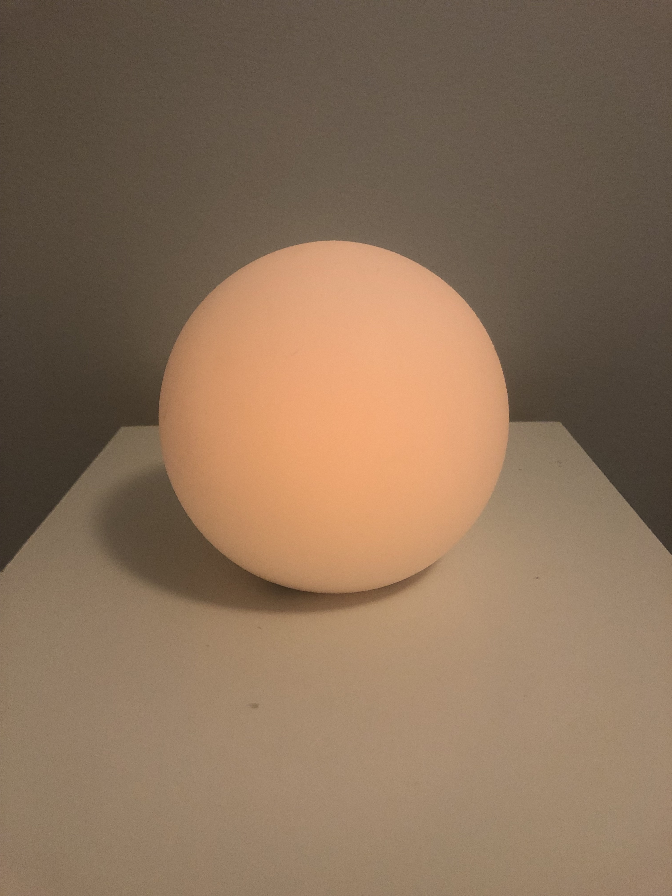

# Staging Interaction

In the original stage production of Peter Pan, Tinker Bell was represented by a darting light created by a small handheld mirror off-stage, reflecting a little circle of light from a powerful lamp. Tinkerbell communicates her presence through this light to the other characters. See more info [here](https://en.wikipedia.org/wiki/Tinker_Bell). 

There is no actor that plays Tinkerbell--her existence in the play comes from the interactions that the other characters have with her.

## Lab Overview
For this assignment, you are going to:

A) [Plan](#part-a-plan) 

B) [Act out the interaction](#part-b-act-out-the-interaction) 

C) [Prototype the device](#part-c-prototype-the-device)

D) [Wizard the device](#part-d-wizard-the-device) 

E) [Costume the device](#part-e-costume-the-device)

F) [Record the interaction](#part-f-record)

Labs are due on Mondays. Make sure this page is linked to on your main class hub page.

## Part A. Plan 

**Background**

The home is a major hub of daily activity for individuals and families across various age groups, from children to elderly adults. This became increasingly important during the pandemic of 2020 as we all shifted a significant part of our “outside the home” activities from schooling to office work to the home, with an array of makeshift solutions to adjust.  During this pandemic, mental health also became increasingly important from feelings of isolation to specific weaknesses in our current social models in how we check up on the elderly who became even more vulnerable during this time.

With all of this in mind, the psychological health and wellbeing of people became even more pressing and saw responses like significant interest in more solutions or apps that cater to this. These apps often require subscriptions to support the regular spoken content they provide but what if we could find a simpler more elementary solution within the home? What about using light as a healing vehicle within the home to adjust the mood of the individual to a healthier state?

**Sceanrio**

To simplify this, we will assume a scenario such as an elderly adult, living alone during the pandemic. Our interactive device “**Luminar**” will help adjust the mood of a person back to a positive state to boost their mental health and wellbeing. We will use one input channel to detect current mood (voice) and use light therapy to respond back with the goal of altering their current mood state back to a positive or neutral outcome. We will focus on correcting two potential moods often felt by elderly adults within the negative spectrum. The first being depression (low arousal) which can be corrected using activating light (orange and red tonal colours).  The second being unrest (high arousal) which can be corrected with a combination of blue light and cyan accented tones known as calming light. We also acknowledge a neutral positive state to be of a general warm yellow amber lighting. You can read more about the research into colour therapy for mood correction within this study done in conjunction with Philips [here](https://www.researchgate.net/publication/276973904_Design_Considerations_for_Adaptive_Lighting_to_Improve_Seniors'_Mood). Please note I will contunie to spell in British style :-)

**Storyboard**

My story board models two scenarios. The first is a senior citizen waking up to a depressed mood. The second is a senior citizen whilst watching television suddenly feels unrest. In both scenariors, Luminar effectively works to bring them back to a positive neutral state and adjsuts the lighting accordingly when this state is reached.

**Feedback from Presentation**

Thought it was a great idea, wondered what lights work for when the elder is in a neutral mood if there was anyway to enhance that further. This will require further research, as one would have to discern the type of neutral mood and develop a model as to how to enhace it further. Also pointed out that this did not need to be limited to elders as children could also experience feelings of depression and unrest but perhaps exhibit it more easily in facial expressions as well as sounds like "argh" rather than vocabulary. Valid points as my research did demostrate a combination of facial recognition (would require computer vision work) and voice recognition is typically used to discern current mood state in participant. The scope of this however can be considered for a longerterm project.

## Part B. Act out the Interaction

What is interesting about the idea is you actually need it to illuminate the room to get the desired effect fully. I tried to turn off other lighting in the room to make it more obvious a particular colour was being emanated from the phone in order to make the science of mood lighting work better. This enhanced the experience and effect.  So perhaps the light needs to not only be powerful enough and well distributed to illuminate the room fully, but also take a central position within it.

## Part C. Prototype the device

**Feedback on Tinkerbelle**

For my interactive device, it is really important to be able to get a tonal colour effect. I appreciated the gradient  colour effect I could achieve from the colour palette as it worked well with the science of mood lighting to affect state given it is combinatory. I also see value in the audio as light and sound are simple effective ways of altering mood. This could be a very useful way to extend the usefulness of the device. 

It would be good to solve for the iPhone contraints however this did not prove to be a significant issue in conducting the experiment i.e. cannot go to full screen on Tinkerbell iPhone side.

## Part D. Wizard the device
 

**Setup Test**

An initial setup to understand the lighting states desired for negative mood lifting can be found here:

[Setup video Luminar](https://youtu.be/GQ99e2AjanU)

**Follow-up Test Run**

In the follow up I was able to model the two possibilities as two seperate interactions. That is, the participant arrives at a depressed state and requires activiating red-amber like lighting, followed by a state of unrest that requires a calming blue-cyan like lighting. These are modelled with objects of similar colours as well as voice recognition by story cards. This interaction can be viewed here:

[Followup Depression Lift video Luminar](https://youtu.be/1LVDZwVrVaw)

[Followup Unrest Lift video Luminar](https://youtu.be/u9evpeFfat0)

## Part E. Costume the device

One of my core considerations in designing the device is it needed to be able to distribute the light well through the room. I thought something spherical or globe like would work well, mimicing a light bulb look in the room but adaptive enough it could easily be placed on a mantle with its own base to stand. 

It also needs to be transparent/translucent so the light can flow through well enough to give the desired effect.

Another angle I thought about exploring, because the goal of the device is to return the participant to a stable positive state was to put a smiley face on it. I decided against this design because I thought it would be limiting its use, I also thought it may come across "scary looking" to always permanently be smiling if the particiapnt was in a foul mood - some user feedback collected mostly agreed with this sentiment. It was more important that the "light do the talking" and communicate the mood based on participant state. 

Finally, I considered the idea it may be useful for touch activation to turn this on and off. This could be good from a mobility perspective for night time for the bedside of an elder but it has to not turn off the entire system, should I later implement this function. Extending this further, voice activation may be even more optimal.

Here is a sketch of what I thought the device may look like:

I decided to find a concave like globe object that had enough transparency to emanate light successfully. I wanted to keep the design simple, I think it is important it does not look like something out of place but also can be a design asthetic choice of lighting when styling a room.

## Part F. Record

**Video of Prototype**
The prototype device can be seen in action here: 

*Lifting Depressive Mood*
[Luminar Full Costume Depression Lift](https://youtu.be/SITc7cP5qVQ)

*Lifting Unrest Mood*
[Luminar Full Costume Unrest Lift](https://youtu.be/SJX0Seco65s)

**Acknowledgements**
Thanks to my family for helping me stage the interaction and also the mood lighting research by Eindhoven and Delft University of Technology in The Netherlands [here](Designconsiderationsforadaptivelightingtoimproveseniorsmood.pdf).

# Staging Interaction, Part 2 

This describes the second week's work for this lab activity.

## Prep (to be done before Lab on Wednesday)

You will be assigned three partners from another group. Go to their github pages, view their videos, and provide them with reactions, suggestions & feedback: explain to them what you saw happening in their video. Guess the scene and the goals of the character. Ask them about anything that wasn’t clear. 

**Feedback Summary**

I got general feedback such as - it was a good concept and very well documented. Two key things I took away.

First, feedback suggested accompanying with a sound to also lift the mood. This formed part of my further research [here](https://www.ncbi.nlm.nih.gov/pmc/articles/PMC6542982/). It also works well with using elemntary concepts like light and sound (cheaper than subscribed spoken content) in terms of my product goals and feature scope.  I explored the Tinkerbell source site for sounds: https://freesound.org/  and identified two accompanying sounds that could work.

1. Acitivating Sound: [Bright and Jocvial Melody](https://freesound.org/people/AlmightyPsyche/sounds/561024/) for low arrousal/depression lift.

2. Calming Sound: [Calming Background Music Orchesrta](https://freesound.org/people/Migfus20/sounds/560453/) for high arrousal/unrest lift.

The second type of feedback was very insightful but will require alot more extensive research. Nevertheless I will document it here. They posed a question around what happens when multiple participants are in the room and to clarify how the device obtains input. The primary mode of input can take two forms. Vision and sound. Computer vision can be used for the first aspect but I have focussed on staging voice interaction instead. The participant can make sounds like grunts or even be asked a question by the device and their voice pattern studied to pick up on the degree to which their mood is negative and requires activation or calming. 

In a scenario of multiple users in a room, my theory or rather approach would be to take in all voices within the room, identify each persons individual note. After which, the device could examine which require lifting and then make an optimal blend of light and sounds based on an optimization algorithm to lift the overall room mood.

For the purposes of this lab's scope, I will simply be focussing on adding the sound element.

## Make it your own

Do last week’s assignment again, but this time: 
1) It doesn’t have to (just) use light, 
2) You can use any modality (e.g., vibration, sound) to prototype the behaviors! Again, be creative!
3) We will be grading with an emphasis on creativity. 

## Part A. Plan 

**Background**

The home is a major hub of daily activity for individuals and families across various age groups, from children to elderly adults. This became increasingly important during the pandemic of 2020 as we all shifted a significant part of our “outside the home” activities from schooling to office work to the home, with an array of makeshift solutions to adjust.  During this pandemic, mental health also became increasingly important from feelings of isolation to specific weaknesses in our current social models in how we check up on the elderly who became even more vulnerable during this time.

With all of this in mind, the psychological health and wellbeing of people became even more pressing and saw responses like significant interest in more solutions or apps that cater to this. These apps often require subscriptions to support the regular spoken content they provide but what if we could find a simpler more elementary solution within the home? What about using light and sound as healing vehicles within the home to adjust the mood of the individual to a healthier state?

**Sceanrio**

To simplify this, we will assume a scenario such as an elderly adult, living alone during the pandemic. Our interactive device “**Luminar**” will help adjust the mood of a person back to a positive state to boost their mental health and wellbeing. We will use one input channel to detect current mood (voice) and use light and sound therapy to respond back with the goal of altering their current mood state back to a positive or neutral outcome. We will focus on correcting two potential moods often felt by elderly adults within the negative spectrum. The first being depression (low arousal) which can be corrected using activating light (orange and red tonal colours) with bright sounds.  The second being unrest (high arousal) which can be corrected with a combination of blue light and cyan accented tones known as calming light with calming oceanic or orchestral sounds. We also acknowledge a neutral positive state to be of a general warm yellow amber lighting (no sound). You can read more about the research into colour therapy for mood correction within this study done in conjunction with Philips [here](https://www.researchgate.net/publication/276973904_Design_Considerations_for_Adaptive_Lighting_to_Improve_Seniors'_Mood). As well as use of sound to alter depressive states of individuals [here](https://www.ncbi.nlm.nih.gov/pmc/articles/PMC6542982/). Please note I will continue to spell in British style :-)

**Storyboard**

My story board models two scenarios. The first is a senior citizen waking up to a depressed mood. The second is a senior citizen whilst watching television suddenly feels unrest. In both scenariors, Luminar effectively works to bring them back to a positive neutral state and adjusts the lighting and sound accordingly when this state is reached.

**_Sketches updated to incorporate feedback around sound_**

**Feedback from Presentation**

Thought it was a great idea, wondered what lights work for when the elder is in a neutral mood if there was anyway to enhance that further. This will require further research, as one would have to discern the type of neutral mood and develop a model as to how to enhace it further. Also pointed out that this did not need to be limited to elders as children could also experience feelings of depression and unrest but perhaps exhibit it more easily in facial expressions as well as sounds like "argh" rather than vocabulary. Valid points as my research did demostrate a combination of facial recognition (would require computer vision work) and voice recognition is typically used to discern current mood state in participant. The scope of this however can be considered for a longerterm project.

## Part B. Act out the Interaction

What is interesting about the idea is you actually need it to illuminate the room to get the desired effect fully. I tried to turn off other lighting in the room to make it more obvious a particular colour was being emanated from the phone in order to make the science of mood lighting work better. This enhanced the experience and effect.  So perhaps the light needs to not only be powerful enough and well distributed to illuminate the room fully, but also take a central position within it.

## Part C. Prototype the device

**Feedback on Tinkerbelle**

For my interactive device, it is really important to be able to get a tonal colour effect. I appreciated the gradient  colour effect I could achieve from the colour palette as it worked well with the science of mood lighting to affect state given it is combinatory. I also see value in the audio as light and sound are simple effective ways of altering mood. This could be a very useful way to extend the usefulness of the device. 

It would be good to solve for the iPhone contraints however this did not prove to be a significant issue in conducting the experiment i.e. cannot go to full screen on Tinkerbell iPhone side.

## Part D. Wizard the device
 

**Setup Test**

An initial setup to understand the lighting states desired for negative mood lifting can be found here:

[Setup video Luminar](https://youtu.be/7wKRyRcbGU4)

**Follow-up Test Run**

In the follow up I was able to model the two possibilities as two seperate interactions. That is, the participant arrives at a depressed state and requires activiating red-amber like lighting, followed by a state of unrest that requires a calming blue-cyan like lighting. These are modelled with objects of similar colours as well as voice recognition by story cards. This interaction can be viewed here:

[Followup Depression Lift video Luminar](https://youtu.be/736NDJJPPAM)

[Followup Unrest Lift video Luminar](https://youtu.be/9c1KNYS7k7U)

## Part E. Costume the device

One of my core considerations in designing the device is it needed to be able to distribute the light well through the room. I thought something spherical or globe like would work well, mimicing a light bulb look in the room but adaptive enough it could easily be placed on a mantle with its own base to stand. 

It also needs to be transparent/translucent so the light can flow through well enough to give the desired effect.

Another angle I thought about exploring, because the goal of the device is to return the participant to a stable positive state was to put a smiley face on it. I decided against this design because I thought it would be limiting its use, I also thought it may come across "scary looking" to always permanently be smiling if the particiapnt was in a foul mood - some user feedback collected mostly agreed with this sentiment. It was more important that the "light do the talking" and communicate the mood based on participant state. 

Finally, I considered the idea it may be useful for touch activation to turn this on and off. This could be good from a mobility perspective for night time for the bedside of an elder but it has to not turn off the entire system, should I later implement this function. Extending this further, voice activation may be even more optimal.

Here is a sketch of what I thought the device may look like intially:

Here is the updated final sketch based on incorporating feedback:

I decided to find a concave like globe object that had enough transparency to emanate light successfully. I wanted to keep the design simple, I think it is important it does not look like something out of place but also can be a design asthetic choice of lighting when styling a room.

## Part F. Record

**Video of Prototype**
The prototype device can be seen in action here: 

*Lifting Depressive Mood*
[Luminar Full Costume Depression Lift](https://youtu.be/RzYixbKK5OI)

*Lifting Unrest Mood*
[Luminar Full Costume Unrest Lift](https://youtu.be/JEGU6cbkujE)

Finally, I stage a nightime interaction and also play around with the gradient colour board to reflect a feedback exchange process of mood light altering with the participant i.e it is trying to mood correct and find the optimum balance for the individual.

*Full Mood Video Nightime*
[Luminar with Gradient Light Approach At Night](https://youtu.be/nGmyzETeqKg)

**Acknowledgements**
Thanks to my family for helping me stage the interactions, to my course colleagues for insightful feeback and also the mood lighting research by Eindhoven and Delft University of Technology in The Netherlands [here](Designconsiderationsforadaptivelightingtoimproveseniorsmood.pdf).
