# Chatterboxes
[](https://www.youtube.com/embed/Q8FWzLMobx0?start=19)

In this lab, we want you to design interaction with a speech-enabled device--something that listens and talks to you. This device can do anything *but* control lights (since we already did that in Lab 1).  First, we want you first to storyboard what you imagine the conversational interaction to be like. Then, you will use wizarding techniques to elicit examples of what people might say, ask, or respond.  We then want you to use the examples collected from at least two other people to inform the redesign of the device.

We will focus on **audio** as the main modality for interaction to start; these general techniques can be extended to **video**, **haptics** or other interactive mechanisms in the second part of the Lab.

## Prep for Part 1: Get the Latest Content and Pick up Additional Parts 

### Pick up Additional Parts

As mentioned during the class, we ordered additional mini microphone for Lab 3. Also, a new part that has finally arrived is encoder! Please remember to pick them up from the TA.

### Get the Latest Content

As always, pull updates from the class Interactive-Lab-Hub to both your Pi and your own GitHub repo. As we discussed in the class, there are 2 ways you can do so:

**\[recommended\]**Option 1: On the Pi, `cd` to your `Interactive-Lab-Hub`, pull the updates from upstream (class lab-hub) and push the updates back to your own GitHub repo. You will need the *personal access token* for this.

```
pi@ixe00:~$ cd Interactive-Lab-Hub
pi@ixe00:~/Interactive-Lab-Hub $ git pull upstream Fall2021
pi@ixe00:~/Interactive-Lab-Hub $ git add .
pi@ixe00:~/Interactive-Lab-Hub $ git commit -m "get lab3 updates"
pi@ixe00:~/Interactive-Lab-Hub $ git push
```

Option 2: On your your own GitHub repo, [create pull request](https://github.com/FAR-Lab/Developing-and-Designing-Interactive-Devices/blob/2021Fall/readings/Submitting%20Labs.md) to get updates from the class Interactive-Lab-Hub. After you have latest updates online, go on your Pi, `cd` to your `Interactive-Lab-Hub` and use `git pull` to get updates from your own GitHub repo.

## Part 1.
### Text to Speech 

In this part of lab, we are going to start peeking into the world of audio on your Pi! 

We will be using a USB microphone, and the speaker on your webcamera. (Originally we intended to use the microphone on the web camera, but it does not seem to work on Linux.) In the home directory of your Pi, there is a folder called `text2speech` containing several shell scripts. `cd` to the folder and list out all the files by `ls`:

```
pi@ixe00:~/text2speech $ ls
Download        festival_demo.sh  GoogleTTS_demo.sh  pico2text_demo.sh
espeak_demo.sh  flite_demo.sh     lookdave.wav
```

You can run these shell files by typing `./filename`, for example, typing `./espeak_demo.sh` and see what happens. Take some time to look at each script and see how it works. You can see a script by typing `cat filename`. For instance:

```
pi@ixe00:~/text2speech $ cat festival_demo.sh 
#from: https://elinux.org/RPi_Text_to_Speech_(Speech_Synthesis)#Festival_Text_to_Speech

echo "Just what do you think you're doing, Dave?" | festival --tts
```

Now, you might wonder what exactly is a `.sh` file? Typically, a `.sh` file is a shell script which you can execute in a terminal. The example files we offer here are for you to figure out the ways to play with audio on your Pi!

You can also play audio files directly with `aplay filename`. Try typing `aplay lookdave.wav`.

\*\***Write your own shell file to use your favorite of these TTS engines to have your Pi greet you by name.**\*\*
(This shell file should be saved to your own repo for this lab.)

Bonus: If this topic is very exciting to you, you can try out this new TTS system we recently learned about: https://github.com/rhasspy/larynx

### Speech to Text

Now examine the `speech2text` folder. We are using a speech recognition engine, [Vosk](https://alphacephei.com/vosk/), which is made by researchers at Carnegie Mellon University. Vosk is amazing because it is an offline speech recognition engine; that is, all the processing for the speech recognition is happening onboard the Raspberry Pi. 

In particular, look at `test_words.py` and make sure you understand how the vocab is defined. Then try `./vosk_demo_mic.sh`

One thing you might need to pay attention to is the audio input setting of Pi. Since you are plugging the USB cable of your webcam to your Pi at the same time to act as speaker, the default input might be set to the webcam microphone, which will not be working for recording.

\*\***Write your own shell file that verbally asks for a numerical based input (such as a phone number, zipcode, number of pets, etc) and records the answer the respondent provides.**\*\*

Bonus Activity:

If you are really excited about Speech to Text, you can try out [Mozilla DeepSpeech](https://github.com/mozilla/DeepSpeech) and [voice2json](http://voice2json.org/install.html)
There is an included [dspeech](./dspeech) demo  on the Pi. If you're interested in trying it out, we suggest you create a seperarate virutal environment for it . Create a new Python virtual environment by typing the following commands.

```
pi@ixe00:~ $ virtualenv dspeechexercise
pi@ixe00:~ $ source dspeechexercise/bin/activate
(dspeechexercise) pi@ixe00:~ $ 
```

### Serving Pages

In Lab 1, we served a webpage with flask. In this lab, you may find it useful to serve a webpage for the controller on a remote device. Here is a simple example of a webserver.

```
pi@ixe00:~/Interactive-Lab-Hub/Lab 3 $ python server.py
 * Serving Flask app "server" (lazy loading)
 * Environment: production
   WARNING: This is a development server. Do not use it in a production deployment.
   Use a production WSGI server instead.
 * Debug mode: on
 * Running on http://0.0.0.0:5000/ (Press CTRL+C to quit)
 * Restarting with stat
 * Debugger is active!
 * Debugger PIN: 162-573-883
```
From a remote browser on the same network, check to make sure your webserver is working by going to `http://<YourPiIPAddress>:5000`. You should be able to see "Hello World" on the webpage.

### Storyboard

Storyboard and/or use a Verplank diagram to design a speech-enabled device. (Stuck? Make a device that talks for dogs. If that is too stupid, find an application that is better than that.) 

**Post your storyboard and diagram here.**
[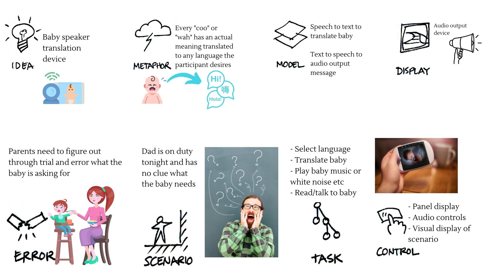](Babyspeakertranslationdevice.jpg)

Write out what you imagine the dialogue to be. Use cards, post-its, or whatever method helps you develop alternatives or group responses. 

Here are post-it notes of what I imagine the dialogue to be like. The pink notes indicate what the device is able to say whilst the green notes signify what types of sounds the baby can make.

[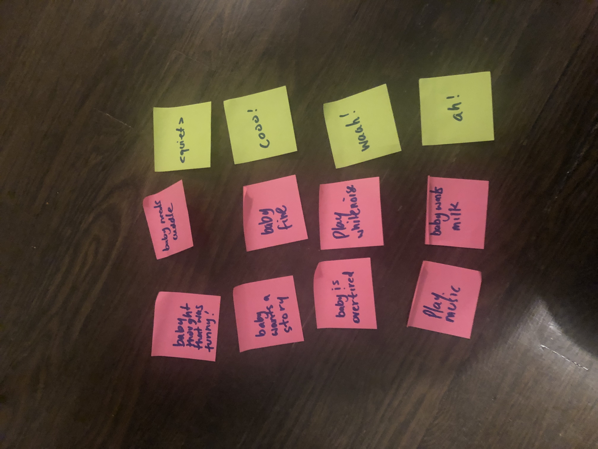](babydevice.jpg)

**Please describe and document your process.**

It was a little dificult to actually script thsi out because part of the problem is the crying noise of the baby is undifferentiated or with litle variation and this is what makes it difficult for the average eprson to figure out whats going on. 

I think whilst voice and signals in teh voice (such as stress) can help, perhaps I need to expalnd the input modalities and account for thing slike schedule in te day to "figue out" what could be wrong like an expereinced nurse or mother would do.

In the end, I created a range of possible output notifications that the device can make informing the parent of what the bay is tryign to say as well as a few that described what the device could do to help.


### Acting out the dialogue

Find a partner, and *without sharing the script with your partner* try out the dialogue you've designed, where you (as the device designer) act as the device you are designing.  Please record this interaction (for example, using Zoom's record feature).

[Video of role play interaction](https://youtu.be/B7cJBg-OGSU)

**Describe if the dialogue seemed different than what you imagined when it was acted out, and how.**

Yes the interaction was different than I imagined it. Without giving the participant clues of what was happening or could happen but just that they were to act like a baby and this was the limited vocabulary they could work with.

On one hand, I am not sure how to completely act this out without giving a little more guidiance because replicating child like behaviour especially with few clues on what is happening is tricky.


### Wizarding with the Pi (optional)
In the [demo directory](./demo), you will find an example Wizard of Oz project. In that project, you can see how audio and sensor data is streamed from the Pi to a wizard controller that runs in the browser.  You may use this demo code as a template. By running the `app.py` script, you can see how audio and sensor data (Adafruit MPU-6050 6-DoF Accel and Gyro Sensor) is streamed from the Pi to a wizard controller that runs in the browser `http://<YouPiIPAddress>:5000`. You can control what the system says from the controller as well!

\*\***Describe if the dialogue seemed different than what you imagined, or when acted out, when it was wizarded, and how.**\*\*

# Lab 3 Part 2

For Part 2, you will redesign the interaction with the speech-enabled device using the data collected, as well as feedback from part 1.

## Prep for Part 2

1. What are concrete things that could use improvement in the design of your device? 

During the role play interaction, it was difficult to not advise the patricipant what to do because they had to infact play the role of a baby. One feedback from the lab session that was helpful with this was, they expected the device to translate by "talking for the baby" rather than just give direct commands for what the other participant (parent/caregiver) should do.

It also seemed as though I was attempting to add in several layers of logic beyond what I had initially intended to do. For example, I was adding on the white noise effect as an automation response by the device based on the schedule of the day (e.g. if the baby has been quiet for so long then play this).

I also realized my storyboard model had failed to take into account some sort of translation engine. 

I did some further research and found that although the data and algorithms were not exposed, there were methods being used with 70-90%+ accuracy for babies under 6 months (when it is most difficult to tell what the issue is) to translate what the cry means. 

A team at UCLA did some research that is harnessed by an app called [Chatterbaby](https://chatterbaby.org/pages/#science).

Training on a dataset of baby crys their method uses a combination of 1. strength, 2. duration and 3. amount of silence within the cry. The premise of this approach is more about detecting pain, discomfort vs tiredness and hunger. It is crucial in those early weeks to be able to differentiate quickly. Further details about another research project done by Liu and her team can be found [here](https://ieeexplore.ieee.org/document/8657383). 

For the scope of this lab however, I will focus on continiung to use Google Text To Speech and create a dictionary of limited "baby words" and then tie them to a specific requests the baby has by translating and speaking for the baby as expected.

2. What are other modes of interaction _beyond speech_ that you might also use to clarify how to interact?

For the type of scenario and device purpose my project entails, it seemed most appropriate to use the camera as a form of motion sensoring. This can also then easily extend to provide a window to view the child remotely. The device can be built to communicate at a very simplistic level if there is motion, it indicates the baby is likely awake. 

Similarly for the scope of this, I will not be analyzing in detail the type of motion but simply focussing on object motion detection using Open CV and alerting through the translation device, the message to be communicated to the participant (or parent).

3. Make a new storyboard, diagram and/or script based on these reflections.

**Updated Verplank diagram**

[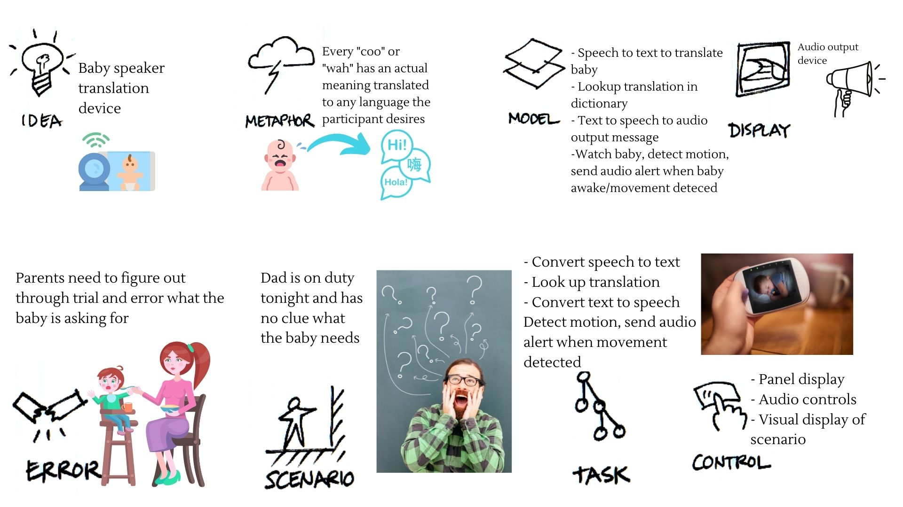](jibber_verplank.jpg)


**Update storyboard**

With limited actors and a key actor (the baby) having to be simulated I will not focus on acting out the full script i.e. mother comes in at the end to provide translated services as it is not actually necessary to demonstrate the translation device works once we hear the translated speech.

[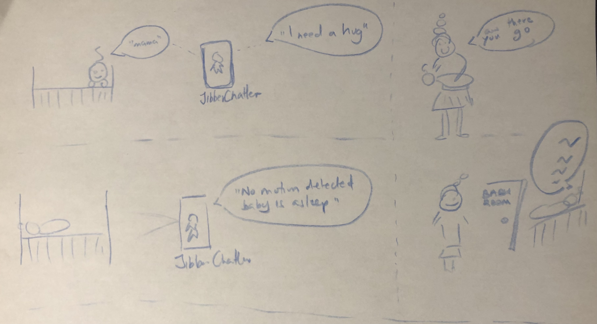](jibber_storyboard.jpg)


## Prototype your system

The system should:
* use the Raspberry Pi - This is utilized.
* use one or more sensors - Chosen the camera and to perform motion detection.
* require participants to speak to it - The baby speaks and the device using a simple translation engine to speak back to other participants.

*Document how the system works*

The general layout of the system functionally from the auditory and visual modalities perspectives.

[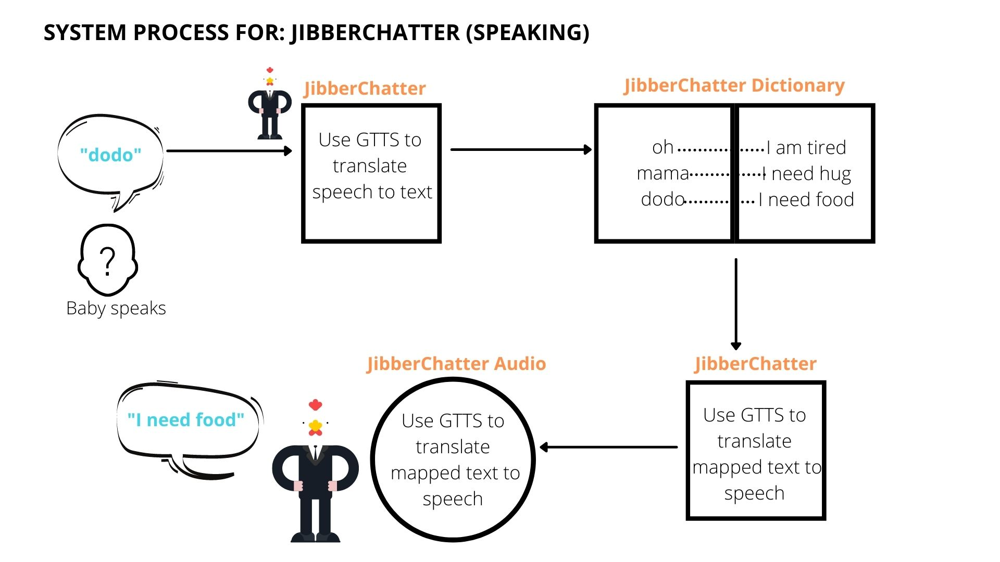](audio_jibber.jpg)

[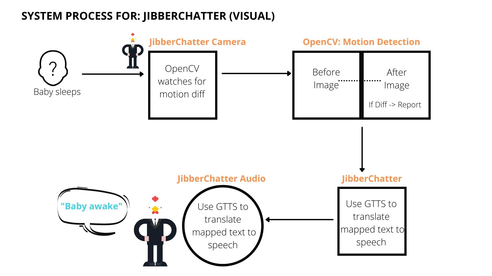](visual_jibber.jpg)


*Include videos or screencaptures of both the system and the controller.*

The wizarding of the system was inspired by the movie "Baby Boss" where a baby is delivered to a family in a suit and is able to talk to his older brother in language "Teddy" can understand but sounds like "jibberish" to adults, hence the name "Jibber Chatter".

Here is what the system looks like with a video at the end depicting the controller from command line and pi simulation.


Enjoy a short click from "The Baby Boss" movie for my inspiration [here](https://www.youtube.com/watch?v=LhBB6HGJ7a8)

*Internal Device*

[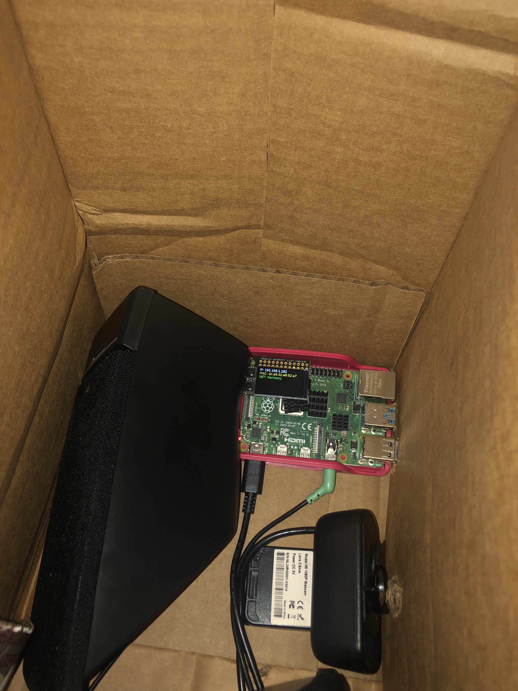](inside_jibber_controller.jpg)

[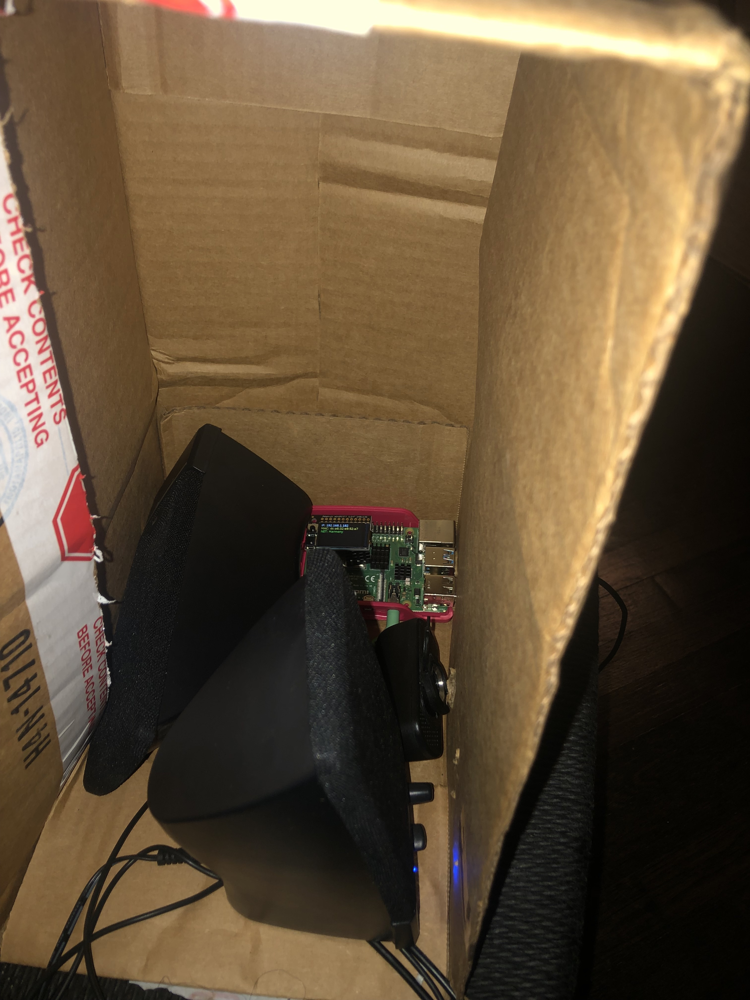](inside_jibber_controller2.jpg)


*External Device*

[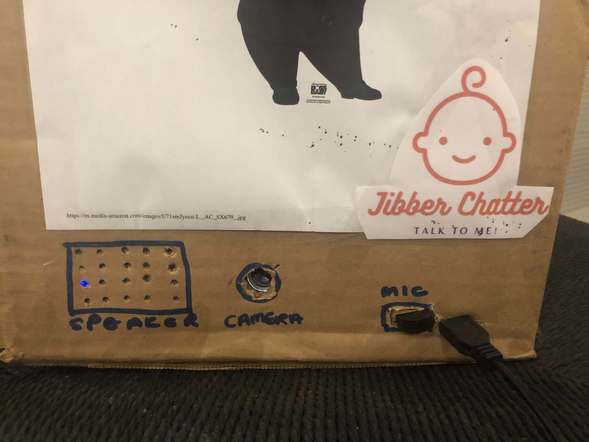](closeup_wizard_jibber.jpg)

[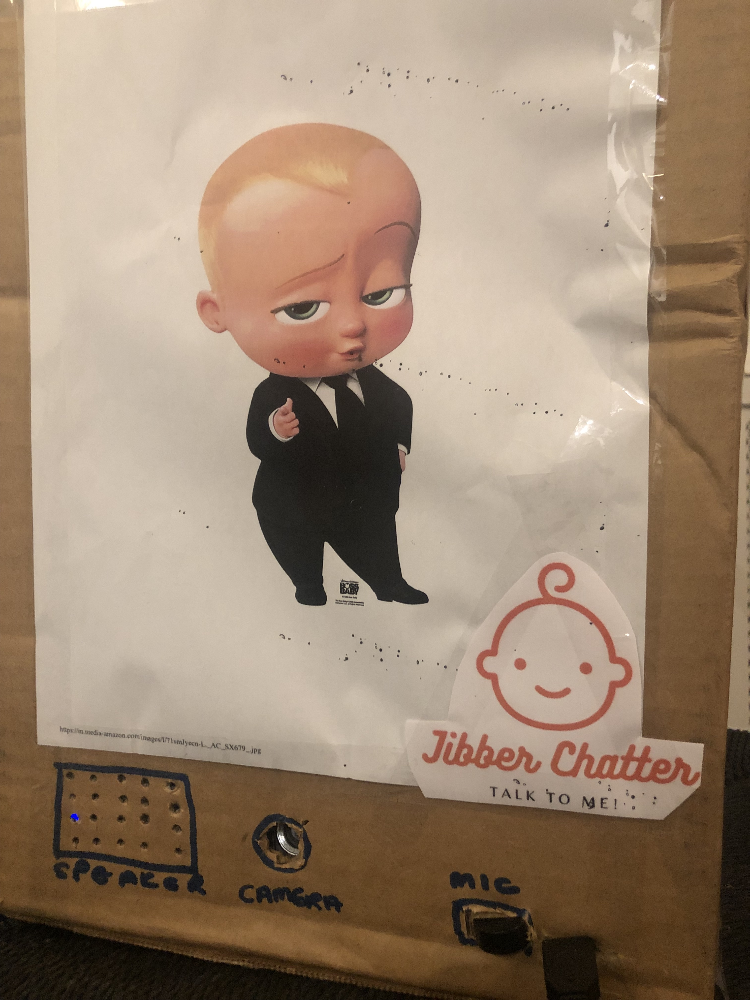](closeup_wizard_jibber2.jpg)

[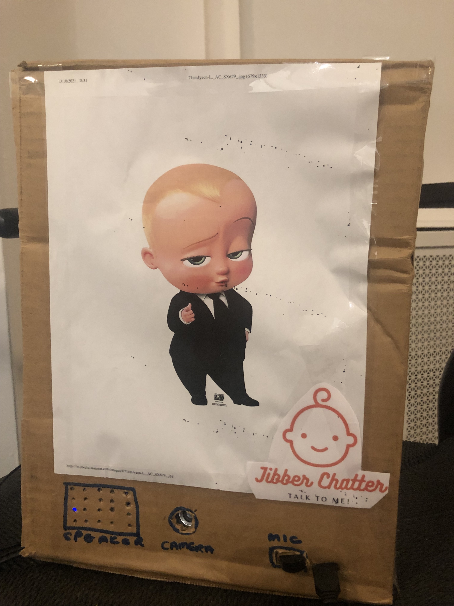](closeup_wizard_jibber3.jpg)

*Controller - Commandline*

I did not utilize the Wizard of Oz controller as it appeared optional, instead I demostrate the commandline and device prototype in costume.

[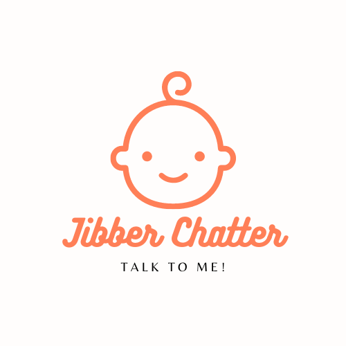](https://youtu.be/ZhLr7nipZqM)

***

*Controller - Wizard Device Dry Run*

[](https://youtu.be/iETj2_p8BSY)


## Test the system
Try to get at least two people to interact with your system. (Ideally, you would inform them that there is a wizard _after_ the interaction, but we recognize that can be hard.)

**Test for "Dodo" Translation and Motion Sensor**

[](https://youtu.be/Xu3lJLm1X8M)

***

**Test for "Mama" Translation and Motion Sensor**

[](https://youtu.be/XanXXfKrVhY)


Answer the following:

### What worked well about the system and what didn't?

Speaking out the pre-determined baby words and having the translation device speak out the translation to English worked well. However words that were similar sounding such as "dodo" and "oh" sometimes were interpreted by the device as similar, and so it made two translations in such events "I want food" and "I am tired" successively.

### What worked well about the controller and what didn't?

It was difficult to simulate this as "always listening, always translating". I had to create a "ding" and "ping" sound to help me delineate when the start and end time was for the mic being active. To move the project forward, one would have to consider that the baby may be continually making those noises, will it take a clip and process just that? Or continually keep listening and making interval based translations?

### What lessons can you take away from the WoZ interactions for designing a more autonomous version of the system?

One key aspect I was unable to model was the mother coming in to provide some sort of action or service in response to the translation. It would be useful to look at improving the visual modality to use this as key feedback in confirming some action has been taken. For example pairing the "I need a hug" with the visual of the paticipant hugging the child. It could then save this data and over time determine if the translations are effective enough in communicating the baby's desires.


### How could you use your system to create a dataset of interaction? What other sensing modalities would make sense to capture?

Similar to the above, you can create a dataset from an audio or visual modality. Making a collection of words uttered and drawing links between actions taken or not taken could help expand and strengthen the system dataset. For example, at the end of the roleplay one of my child participants said "Can we make it interpret more baby words?" It did make me think, perhaps not everything has to be learned in a slow unsupervised way. Perhaps we can train it as you would when learning a second language and explictly program some words like I have done, then watch and record how accurate they appease the child and meet their needs and try to adjust the translations accordingly.

In terms of other sensing modalities perhaps the most obvious one would be some sort of [Machine olfaction](https://en.wikipedia.org/wiki/Machine_olfaction#:~:text=Machine%20olfaction%20is%20the%20automated,electronic%20nose%20or%20e%2Dnose.) That would detect if the baby requires a diaper change or even as simple as a pressue device to see if there is more weight on the bed overtime. When paired with a calendar of the day, it may improve prediction and also alert the key caregiving participants that an incidence requires their attention "I need a diaper change".

I would like to thank my family for helping me build the wizarding elements, this was perhaps the most tedious of projects so far with so much scope for further development.

