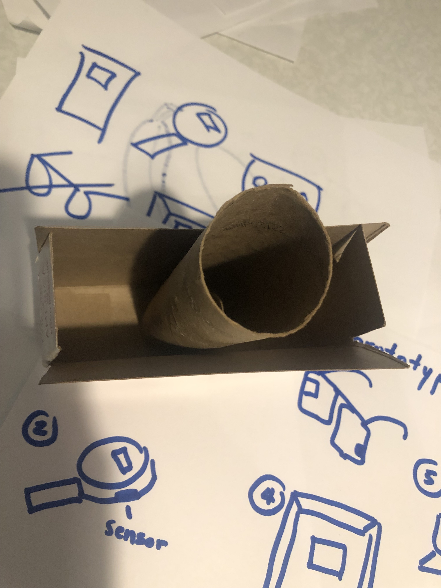

# Ph-UI!!!

For lab this week, we focus on both on sensing, to bring in new modes of input into your devices, as well as prototyping the physical look and feel of the device. You will think about the physical form the device needs to perform the sensing as well as present the display or feedback about what was sensed. 

## Part 1 Lab Preparation

### Get the latest content:
As always, pull updates from the class Interactive-Lab-Hub to both your Pi and your own GitHub repo. As we discussed in the class, there are 2 ways you can do so:

**\[recommended\]**Option 1: On the Pi, `cd` to your `Interactive-Lab-Hub`, pull the updates from upstream (class lab-hub) and push the updates back to your own GitHub repo. You will need the personal access token for this.

```
pi@ixe00:~$ cd Interactive-Lab-Hub
pi@ixe00:~/Interactive-Lab-Hub $ git pull upstream Fall2021
pi@ixe00:~/Interactive-Lab-Hub $ git add .
pi@ixe00:~/Interactive-Lab-Hub $ git commit -m "get lab4 content"
pi@ixe00:~/Interactive-Lab-Hub $ git push
```

Option 2: On your your own GitHub repo, [create pull request](https://github.com/FAR-Lab/Developing-and-Designing-Interactive-Devices/blob/2021Fall/readings/Submitting%20Labs.md) to get updates from the class Interactive-Lab-Hub. After you have latest updates online, go on your Pi, `cd` to your `Interactive-Lab-Hub` and use `git pull` to get updates from your own GitHub repo.

### Start brasinstorming ideas by reading: 
* [What do prototypes prototype?](https://www.semanticscholar.org/paper/What-do-Prototypes-Prototype-Houde-Hill/30bc6125fab9d9b2d5854223aeea7900a218f149)
* [Paper prototyping](https://www.uxpin.com/studio/blog/paper-prototyping-the-practical-beginners-guide/) is used by UX designers to quickly develop interface ideas and run them by people before any programming occurs. 
* [Cardboard prototypes](https://www.youtube.com/watch?v=k_9Q-KDSb9o) help interactive product designers to work through additional issues, like how big something should be, how it could be carried, where it would sit. 
* [Tips to Cut, Fold, Mold and Papier-Mache Cardboard](https://makezine.com/2016/04/21/working-with-cardboard-tips-cut-fold-mold-papier-mache/) from Make Magazine.
* [Surprisingly complicated forms](https://www.pinterest.com/pin/50032245843343100/) can be built with paper, cardstock or cardboard.  The most advanced and challenging prototypes to prototype with paper are [cardboard mechanisms](https://www.pinterest.com/helgangchin/paper-mechanisms/) which move and change. 
* [Dyson Vacuum Cardboard Prototypes](http://media.dyson.com/downloads/JDF/JDF_Prim_poster05.pdf)
<p align="center"> </p>

### Gathering materials for this lab:

* Cardboard (start collecting those shipping boxes!)
* Found objects and materials--like bananas and twigs.
* Cutting board
* Cutting tools
* Markers

(We do offer shared cutting board, cutting tools, and markers on the class cart during the lab, so do not worry if you don't have them!)

## Deliverables \& Submission for Lab 4

The deliverables for this lab are, writings, sketches, photos, and videos that show what your prototype:
* "Looks like": shows how the device should look, feel, sit, weigh, etc.
* "Works like": shows what the device can do.
* "Acts like": shows how a person would interact with the device.

For submission, the readme.md page for this lab should be edited to include the work you have done:
* Upload any materials that explain what you did, into your lab 4 repository, and link them in your lab 4 readme.md.
* Link your Lab 4 readme.md in your main Interactive-Lab-Hub readme.md. 
* Group members can turn in one repository, but make sure your Hub readme.md links to the shared repository.
* Labs are due on Mondays, make sure to submit your Lab 4 readme.md to Canvas.


## Lab Overview

A) [Capacitive Sensing](#part-a)

B) [OLED screen](#part-b) 

C) [Paper Display](#part-c)

D) [Materiality](#part-d)

E) [Servo Control](#part-e)

F) [Record the interaction](#part-f)

## The Report (Part 1: A-D, Part 2: E-F)

### Part A
### Capacitive Sensing, a.k.a. Human-Twizzler Interaction 

We want to introduce you to the [capacitive sensor](https://learn.adafruit.com/adafruit-mpr121-gator) in your kit. It's one of the most flexible input devices we are able to provide. At boot, it measures the capacitance on each of the 12 contacts. Whenever that capacitance changes, it considers it a user touch. You can attach any conductive material. In your kit, you have copper tape that will work well, but don't limit yourself! In the example below, we use Twizzlers--you should pick your own objects.


<p float="left">


</p>

Plug in the capacitive sensor board with the QWIIC connector. Connect your Twizzlers with either the copper tape or the alligator clips (the clips work better). In this lab, we will continue to use the `circuitpython` virtual environment we created before. Activate `circuitpython` and `cd` to your Lab 4 folder to install the requirements by:

```
(circuitpython) pi@ixe00:~/Interactive-Lab-Hub/Lab 4 $ pip3 install -r requirements.txt
```


These Twizzlers are connected to pads 6 and 10. When you run the code and touch a Twizzler, the terminal will print out the following

```
(circuitpython) pi@ixe00:~/Interactive-Lab-Hub/Lab 4 $ python cap_test.py 
Twizzler 10 touched!
Twizzler 6 touched!
```

### Part B
### More sensors

#### Light/Proximity/Gesture sensor (APDS-9960)

We here want you to get to know this awesome sensor [Adafruit APDS-9960](https://www.adafruit.com/product/3595). It is capable of sensing proximity, light (also RGB), and gesture! 


Connect it to your pi with Qwiic connector and try running the three example scripts individually to see what the sensor is capable of doing!

```
(circuitpython) pi@ixe00:~/Interactive-Lab-Hub/Lab 4 $ python proximity_test.py
...
(circuitpython) pi@ixe00:~/Interactive-Lab-Hub/Lab 4 $ python gesture_test.py
...
(circuitpython) pi@ixe00:~/Interactive-Lab-Hub/Lab 4 $ python color_test.py
...
```

You can go the the [Adafruit GitHub Page](https://github.com/adafruit/Adafruit_CircuitPython_APDS9960) to see more examples for this sensor!

#### Rotary Encoder

A rotary encoder is an electro-mechanical device that converts the angular position to analog or digital output signals. The [Adafruit rotary encoder](https://www.adafruit.com/product/4991#technical-details) we ordered for you came with separated breakout board and encoder itself, that is, they will need to be soldered if you have not yet done so! We will be bringing the soldering station to the lab class for you to use, also, you can go to the MakerLAB to do the soldering off-class. Here is some [guidance on soldering](https://learn.adafruit.com/adafruit-guide-excellent-soldering/preparation) from Adafruit. When you first solder, get someone who has done it before (ideally in the MakerLAB environment). It is a good idea to review this material beforehand so you know what to look at.

<p float="left">


</p>

Connect it to your pi with Qwiic connector and try running the example script, it comes with an additional button which might be useful for your design!

```
(circuitpython) pi@ixe00:~/Interactive-Lab-Hub/Lab 4 $ python encoder_test.py
```

You can go to the [Adafruit Learn Page](https://learn.adafruit.com/adafruit-i2c-qt-rotary-encoder/python-circuitpython) to learn more about the sensor! The sensor actually comes with an LED (neo pixel): Can you try lighting it up? 

#### Joystick

A [joystick](https://www.sparkfun.com/products/15168) can be used to sense and report the input of the stick for it pivoting angle or direction. It also comes with a button input!

<p float="left">

</p>

Connect it to your pi with Qwiic connector and try running the example script to see what it can do!

```
(circuitpython) pi@ixe00:~/Interactive-Lab-Hub/Lab 4 $ python joystick_test.py
```

You can go to the [SparkFun GitHub Page](https://github.com/sparkfun/Qwiic_Joystick_Py) to learn more about the sensor!

#### (Optional) Distance Sensor

Note: We did not distribute this sensor to you, so if you are interested in playing with it, please come pick it up from the TA!

Earlier we have asked you to play with the proximity sensor, which is able to sense object within a short distance. Here, we offer [Qwiic Multi Distance Sensor](https://www.sparkfun.com/products/17072), which has a field of view of about 25° and is able to detect objects up to 3 meters away! 

<p float="left">

</p>

Connect it to your pi with Qwiic connector and try running the example script to see how it works!

```
(circuitpython) pi@ixe00:~/Interactive-Lab-Hub/Lab 4 $ python distance_test.py
```

You can go to the [SparkFun GitHub Page](https://github.com/sparkfun/Qwiic_VL53L1X_Py) to learn more about the sensor and see other examples!

### Part C
### Physical considerations for sensing

Usually, sensors need to positioned in specific locations or orientations to make them useful for their application. Now that you've tried a bunch of the sensors, pick one that you would like to use, and an application where you use the output of that sensor for an interaction. For example, you can use a distance sensor to measure someone's height if you position it overhead and get them to stand under it.

**Draw 5 sketches of different ways you might use your sensor, and how the larger device needs to be shaped in order to make the sensor useful.**

1. People counter - adding a senor device to the door to check how many people have entered the room whenever there is a break in proximity within the door frame
2. Music swipper - switch to the previous on next song with just one swipe in the air "left or right"
3. Food ripener check - Food like avocado are very popoular but sometimes difficult to tell if its ripe enough to eat without cutting it first!
4. Vending machine - Order products based on specific colur entered by user through selection on display sensor. The machine then converts to the RGB code reuest and using a sensor placed on a mobile pad finds the first product that meets the color seelction. e.g. red lolipop
5. Proximity sensor - If it is placed near the entrace of the pen, then whenever the cat passes it, you can be notified how close the cat is to various rooms within the home.


**What are some things these sketches raise as questions? What do you need to physically prototype to understand how to answer those questions?**

The size of the object is important, like how large is the items that holds it elative to size of sensor? Also the material has to be able to hold the sensor inan embeded way that still allows for interaction to detect objects. The cat example may require multiple sensors so you can tell how far he is relative to various distances not just one. With the magnifying glass example, if the item is made from glass will it make sense given one will equire a sensor on the outside of the tool as well as a display on the other side for feedback?

I would need to prototype how the sensor and display are placed in order for the product to "naturally" work with little intuition. If I am using a magnifying glass to inspect something, I expect to read the information on the upper side facing me but I understand I will need the sensor to be placed on the opposing side so the user experience feels close to how they would natuarlly use a magnifying glass to inspect an item.

**Pick one of these designs to prototype.**

[](isitready.jpeg)

**The State of Avocado Selection**

Selecting the magnfiying glass device. In Europe avocados have regained a renewed interest becoming incredibly popular over the last 5 years as the "the healthy fat" to add to every meal.  One fustration I have had with it is it can be dificult to tell that it is the "right" level of ripe I desire for edible consumption.

It would be cool if a device can be used and based on training data program the optimized RGB colour for ripeness or even learn my personal RGB preference. Similalry, there are dishes that require green plantains (unripe) and those that require ripe plantains, so you can use it for other recipe applications as well.

I will call this device **_"izit"_** thats is to say: "Is it ripe?"

### Part D
### Physical considerations for displaying information and housing parts


Here is an Pi with a paper faceplate on it to turn it into a display interface:


This is fine, but the mounting of the display constrains the display location and orientation a lot. Also, it really only works for applications where people can come and stand over the Pi, or where you can mount the Pi to the wall.

Here is another prototype for a paper display:


Your kit includes these [SparkFun Qwiic OLED screens](https://www.sparkfun.com/products/17153). These use less power than the MiniTFTs you have mounted on the GPIO pins of the Pi, but, more importantly, they can be more flexibily be mounted elsewhere on your physical interface. The way you program this display is almost identical to the way you program a  Pi display. Take a look at `oled_test.py` and some more of the [Adafruit examples](https://github.com/adafruit/Adafruit_CircuitPython_SSD1306/tree/master/examples).

<p float="left">


</p>


It holds a Pi and usb power supply, and provides a front stage on which to put writing, graphics, LEDs, buttons or displays.

This design can be made by scoring a long strip of corrugated cardboard of width X, with the following measurements:

| Y height of box <br> <sub><sup>- thickness of cardboard</sup></sub> | Z  depth of box <br><sub><sup>- thickness of cardboard</sup></sub> | Y height of box  | Z  depth of box | H height of faceplate <br><sub><sup>* * * * * (don't make this too short) * * * * *</sup></sub>|
| --- | --- | --- | --- | --- | 

Fold the first flap of the strip so that it sits flush against the back of the face plate, and tape, velcro or hot glue it in place. This will make a H x X interface, with a box of Z x X footprint (which you can adapt to the things you want to put in the box) and a height Y in the back. 

Here is an example:


Think about how you want to present the information about what your sensor is sensing! Design a paper display for your project that communicates the state of the Pi and a sensor. Ideally you should design it so that you can slide the Pi out to work on the circuit or programming, and then slide it back in and reattach a few wires to be back in operation.
 
**Sketch 5 designs for how you would physically position your display and any buttons or knobs needed to interact with it.**

1. Box device - houses display and controls front side
2. Maginfying glass style design
3. Glasses with display panel and embeded sensor
4. Photoframe, hold up items to check and interact with buttons at the bottom
5. Bowl with sensors embeded and display panel at base, can also be programmed to produce other metrics or integrated with dish ideas per weight and size of avocadoes or bananas


**What are some things these sketches raise as questions? What do you need to physically prototype to understand how to anwer those questions?**

Will it be convenient for the user to always put on glasses to check the fruit ripeness and is that dislay for the context of their interaction (probably in a kitchen?) actually apporporiate. 

I need to see how the sensor positioning relative to the display will be optimally placed to enhance the user expereince.

**Pick one of these display designs to integrate into your prototype.**

Chosen the magnifying glass design for izit and will customize to rectangular shape for easier prototyping.


**Explain the rationale for the design.** (e.g. Does it need to be a certain size or form or need to be able to be seen from a certain distance?)

This needs to be sized relative to the average human hand. It also needs to be light. The sensor should face downwards in the same way one would use a magnifying glass and the feedback should be upwards over the plate. I do not think it maters if they are directly opposite each other but let me prototype it!

Build a cardbord prototype of your design.

**Document your rough prototype.**
I used cardboard boxes, customized the sizes down and cut out panels for the display and sensor on opposing sides.

I held the sensor and display down through cellotape within the box and then inserted the pi and let teh cables flow out through the circular tube from the core of a kitchen towel.

I wraped it all up in white leftover paper and added the logo to the front.





**Final Paper Prototype**


LAB PART 2

### Part 2

Following exploration and reflection from Part 1, complete the "looks like," "works like" and "acts like" prototypes for your design, reiterated below.

### Part E (Optional)
### Servo Control with Joystick

In the class kit, you should be able to find the [Qwiic Servo Controller](https://www.sparkfun.com/products/16773) and [Micro Servo Motor SG51](https://www.adafruit.com/product/2201). The Qwiic Servo Controller will need external power supply to drive, which we will be distributing the battery packs in the class. Connect the servo controller to the miniPiTFT through qwiic connector and connect the external battery to the 2-Pin JST port (ower port) on the servo controller. Connect your servo to channel 2 on the controller, make sure the brown is connected to GND and orange is connected to PWM.


In this exercise, we will be using the nice [ServoKit library](https://learn.adafruit.com/16-channel-pwm-servo-driver/python-circuitpython) developed by Adafruit! We will continue to use the `circuitpython` virtual environment we created. Activate the virtual environment and make sure to install the latest required libraries by running:

```
(circuitpython) pi@ixe00:~/Interactive-Lab-Hub/Lab 4 $ pip3 install -r requirements.txt
```

A servo motor is a rotary actuator or linear actuator that allows for precise control of angular or linear position. The position of a servo motor is set by the width of an electrical pulse, that is, we can use PWM (pulse-width modulation) to set and control the servo motor position. You can read [this](https://learn.adafruit.com/adafruit-arduino-lesson-14-servo-motors/servo-motors) to learn a bit more about how exactly a servo motor works.

Now that you have a basic idea of what a servo motor is, look into the script `qwiic_servo_example.py` we provide. In line 14, you should see that we have set up the min_pulse and max_pulse corresponding to the servo turning 0 - 180 degree. Try running the servo example code now and see what happens:

```
(circuitpython) pi@ixe00:~/Interactive-Lab-Hub/Lab 4 $ python servo_test.py
```

It is also possible to control the servo using the sensors mentioned in as in part A and part B, and/or from some of the buttons or parts included in your kit, the simplest way might be to chain Qwiic buttons to the other end of the Qwiic OLED. Like this:

<p align="center"> </p>

You can then call whichever control you like rather than setting a fixed value for the servo. For more information on controlling Qwiic devices, Sparkfun has several python examples, such as [this](https://learn.sparkfun.com/tutorials/qwiic-joystick-hookup-guide/all#python-examples).

We encourage you to try using these controls, **while** paying particular attention to how the interaction changes depending on the position of the controls. For example, if you have your servo rotating a screen (or a piece of cardboard) from one position to another, what changes about the interaction if the control is on the same side of the screen, or the opposite side of the screen? Trying and retrying different configurations generally helps reveal what a design choice changes about the interaction -- _make sure to document what you tried_!

**Testing Sensors For Izit**

I expand below (Part F) on what I tried, but here is a short clip on one of my trials with the servo.

***
[](https://youtu.be/shX0f09OHHo)
***


### Part F
### Record

Document all the prototypes and iterations you have designed and worked on! Again, deliverables for this lab are writings, sketches, photos, and videos that show what your prototype:
* "Looks like": shows how the device should look, feel, sit, weigh, etc.
* "Works like": shows what the device can do
* "Acts like": shows how a person would interact with the device

**Izit Feedback**

The feedback I received from Izit Version 1 was positive around having made a good useful product with the "cool" name and to explore the sensors further. Another participant talked about putting more informative data on the display e.g. how many days left to consume the avocado. Generally feedback was this was a good design.

I agree the concept is interesting but disagreed the design was good. When I thought about the practicality of printing a 3d magnifying object and inserting the Pi within it, the design asthetics did not seem appealing and the weight of carrying such an item in the kitchen when in use seemed inpractical. Since I could not gain access to the makers lab yet, this rationale and rethink took me on a different path. 

**New Design Sketch**

Although this started as an avocado project, it can easily be extended to other vegetables and fruit categories. For example, with further research I discovered the use of spectral color and neural networks could be used in a different but similar application to detect stage of ripeness in produce. I loved to see that this idea could actually develop some scalability and help within grocery chains and production chains to quickly sort fruit and vegetables at scale.  To see more on a project where training data was built to detect "stages of ripening" please visit [here](https://www.hackster.io/kutluhan-aktar/vegetables-and-fruits-ripeness-detection-by-color-w-tf-041f92).

With flexibility of use in mind, I pivoted to a design that could be mounted on a kitchen worktop. Like a toaster, it need not be pulled out per use but can be ready to go and perhaps later extended to recommend what healthy meals the participant could produce from the item based on its state of ripeness. e.g. too soft avocado becomes gucamole, firmer avocado can be sliced into a snack dipped in honey e.t.c.

As a result, _izit_ got a rebrand, final sketch below.


The sensors/mechanisms I wanted to explore were
1. Color sensor - to detect ripness factor
2. Servo - to mount the color sensor on to provide rotation to obtain the color channel coordinates for more than one surface area location on the fruit
3. The display to provide inforamtional feedback and perhaps action to the participant
4. Some sort of sensor to start the process, I opted for a button in the end

**Trials**

For my first trial, after working through all the sensors, I wanted to test the servo and explore with the other sensors what was possible.  At first, I thought using some object to push the sesor around such as cardboard moved by the servo could work, but because the item needed to hang down and with gravity, this was really tricky to pull off. Moreover, the color sensor is very senstive and has a wide channel. So without a secure servo/color sensor bonding, the color readings were all over the place. It actually took a bit of time to debug and translate the color from the sesnsor into an appropriate channel form that reflected the color being picked up also correctly.

**Izit Servo And Light Sensor Test**
***
[](https://youtu.be/Trv9PS1DppM)
***


So you can see that this trial was unsuccessful and after a few tries it fell apart. The sticky tape was not strong enough for the force of the servo motion when running to hold together.

I then reduced how much I moved the servo, dropping down to 10 degree rotation. This did not give me varied values across the surface area of fruit, the readings were just too tight at 10 degrees movement. 

So I resorted to bond the disposeable plastic turnstine on the servo to the back of the color sensor. This worked!


Below is an outline of my algorithm. This can be easily extended with more training data and network training, but for the purposes of this excercise satisfied the outcomes required. I also noticed that since I started the project in the morning, by the time I tried to wrap up final videos at night, I had to reset color expectations for ripe and unripe because as mentioned earlier, the light sensor is very sensitive to light and the room lighting change impacted interpretations. That is something we could design for, 'night mode/day mode" or we could add time to the device e.t.c.

**System/Algo Design**

The genreal concept is simple:

1. Take two readings from the surface of the fruit on color channels
2. Take their average values
3. Measure the Euclidean distance between these values and what we have trained the system to understand as a ripe color channel.
4. Decide what category the reading falls into based on distance from target (ripe) with an appropriate interaction message to support for user feedback

**Paper Prototype**

It was a good idea to try a rough prototype because it helped inform me on how I could correctly configure the devices and sensors behind the scene, paticularly space wise.  

I used this YouTube video below as inspiration, it is effectively building a coffee machine which is similar to my sketch but with other design modifications and features. 

***
[](https://www.youtube.com/watch?app=desktop&feature=youtu.be&v=HgzQIWhskMk)
***

You will see I also had to use my Cornell Tech cup (which I won in Product Studio :-))to prop up the fruit in trials to ensure it was close enough to picking up the right color readings. I considered making this distance shorter in my final design but with enough wiggle room to extend to other vegetables/fruits.

See images and video trials below.

**Paper Prototype - Izit Version 2**

<p float="left">
  
   
  
</p>

<p float="left">
  
   
  
</p>
<p float="left">
  
   
  
</p>

**Paper Prototype - Izit Version 2**
***
[](https://youtu.be/y04dkYDrVak)
***

**Final Prototype - Izit Version 3**

For the final prototype, I created a less bulky design, more compact and easier to use on a kitchen top. I also added a cylinder like panel over the servo/color sensor to help the user identify easily where to place the fruit quickly. I found in my paper prototype I was constantly looking under the area to find "the best spot" to place it. 

I also loaded my push button with items behind so I did not have to constantly have my hand holding it in place with the force of a push.

I also made minor tweaks to my sketch to align the "on" button to the right (as most participants interacting are likely to be right handed and expect this) and it seemed spacially and asthetically approporate to horizontally configure the display at a similar level on the other side. 

This is the process of building.

**Final Prototype Build**

<p float="left">
  
   
  
</p>
<p float="left">
  
   
  
</p>
<p float="left">
  
   
  
</p>
<p float="left">
  
   
  
</p>
<p float="left">
  
   
  
</p>
<p float="left">
  
   
  
</p>

 <p float="left">
  
   
  
</p>

_Final Izit Design_

 

***

**What It Looks Like**

So from sketch to final design, this is what it looks like. I was mindful to organize the inside better third time around with the socket plug connecting at the base neatly.

With a few tools, I achieved a neater more compact design.  It has really evolved since version 1 in the earlier lab :-)

 

***

**What It Works Like**

Here is an overview of what the device does:

1. Initiate "on" button to intialize the rotation of the central mount to check the fruit color over 180 degrees area
2. It reads in the color channels and also identifies compared to the training data, what category the item falls within
3. It will then display based on the caetgory outcome the result and an accompanying action to support such as "Wait" or "Eat".

Adding voice interaction and recipie planner could be interesting ways to expand. It would also be impotrant to do more categorization fo objects if you used it for a wider selection of fruit and vegetables, it would need to first identify the category then use the data it has learned from on what color corresponds to ripe for a particular cateogry of food item.

 

***

**What It Acts Like**

Here are a series of final demo video clips on the final product, _Izit version 3.0_ - The Ripe Food Checker.


**Izit v3 Full Demo**

[](https://youtu.be/qSDhD79xmJw)
***

**Izit v3 Closeup Demo**

[](https://youtu.be/EQkcWSTewpA)
***

**Izit v3 Under The Hood Demo**

[](https://youtu.be/ezYmdvx3S2A)
***


As always, thanks to my amazing family for their support on the paper prototyping aspects, we had fun and enjoyed ripe avocados 🥑 :-)

