# Observant Systems


For lab this week, we focus on creating interactive systems that can detect and respond to events or stimuli in the environment of the Pi, like the Boat Detector we mentioned in lecture. 
Your **observant device** could, for example, count items, find objects, recognize an event or continuously monitor a room.

This lab will help you think through the design of observant systems, particularly corner cases that the algorithms needs to be aware of.

## Prep

1.  Pull the new Github Repo.
2.  Install VNC on your laptop if you have not yet done so. This lab will actually require you to run script on your Pi through VNC so that you can see the video stream. Please refer to the [prep for Lab 2](https://github.com/FAR-Lab/Interactive-Lab-Hub/blob/Fall2021/Lab%202/prep.md), we offered the instruction at the bottom.
3.  Read about [OpenCV](https://opencv.org/about/), [MediaPipe](https://mediapipe.dev/), and [TeachableMachines](https://teachablemachine.withgoogle.com/).
4.  Read Belloti, et al.'s [Making Sense of Sensing Systems: Five Questions for Designers and Researchers](https://www.cc.gatech.edu/~keith/pubs/chi2002-sensing.pdf).

### For the lab, you will need:

1. Raspberry Pi
1. Webcam 
1. Microphone (if you want to have speech or sound input for your design)

### Deliverables for this lab are:
1. Show pictures, videos of the "sense-making" algorithms you tried.
1. Show a video of how you embed one of these algorithms into your observant system.
1. Test, characterize your interactive device. Show faults in the detection and how the system handled it.

## Overview
Building upon the paper-airplane metaphor (we're understanding the material of machine learning for design), here are the four sections of the lab activity:

A) [Play](#part-a)

B) [Fold](#part-b)

C) [Flight test](#part-c)

D) [Reflect](#part-d)

---

### Part A
### Play with different sense-making algorithms.

#### OpenCV
A more traditional method to extract information out of images is provided with OpenCV. The RPI image provided to you comes with an optimized installation that can be accessed through python. We included 4 standard OpenCV examples: contour(blob) detection, face detection with the ``Haarcascade``, flow detection (a type of keypoint tracking), and standard object detection with the [Yolo](https://pjreddie.com/darknet/yolo/) darknet.

Most examples can be run with a screen (e.g. VNC or ssh -X or with an HDMI monitor), or with just the terminal. The examples are separated out into different folders. Each folder contains a ```HowToUse.md``` file, which explains how to run the python example. 

Following is a nicer way you can run and see the flow of the `openCV-examples` we have included in your Pi. Instead of `ls`, the command we will be using here is `tree`. [Tree](http://mama.indstate.edu/users/ice/tree/) is a recursive directory colored listing command that produces a depth indented listing of files. Install `tree` first and `cd` to the `openCV-examples` folder and run the command:

```shell
pi@ixe00:~ $ sudo apt install tree
...
pi@ixe00:~ $ cd openCV-examples
pi@ixe00:~/openCV-examples $ tree -l
.
├── contours-detection
│   ├── contours.py
│   └── HowToUse.md
├── data
│   ├── slow_traffic_small.mp4
│   └── test.jpg
├── face-detection
│   ├── face-detection.py
│   ├── faces_detected.jpg
│   ├── haarcascade_eye_tree_eyeglasses.xml
│   ├── haarcascade_eye.xml
│   ├── haarcascade_frontalface_alt.xml
│   ├── haarcascade_frontalface_default.xml
│   └── HowToUse.md
├── flow-detection
│   ├── flow.png
│   ├── HowToUse.md
│   └── optical_flow.py
└── object-detection
    ├── detected_out.jpg
    ├── detect.py
    ├── frozen_inference_graph.pb
    ├── HowToUse.md
    └── ssd_mobilenet_v2_coco_2018_03_29.pbtxt
```

The flow detection might seem random, but consider [this recent research](https://cseweb.ucsd.edu/~lriek/papers/taylor-icra-2021.pdf) that uses optical flow to determine busy-ness in hospital settings to facilitate robot navigation. Note the velocity parameter on page 3 and the mentions of optical flow.

Now, connect your webcam to your Pi and use **VNC to access to your Pi** and open the terminal. Use the following command lines to try each of the examples we provided:
(***it will not work if you use ssh from your laptop***)

```
pi@ixe00:~$ cd ~/openCV-examples/contours-detection
pi@ixe00:~/openCV-examples/contours-detection $ python contours.py
...
pi@ixe00:~$ cd ~/openCV-examples/face-detection
pi@ixe00:~/openCV-examples/face-detection $ python face-detection.py
...
pi@ixe00:~$ cd ~/openCV-examples/flow-detection
pi@ixe00:~/openCV-examples/flow-detection $ python optical_flow.py 0 window
...
pi@ixe00:~$ cd ~/openCV-examples/object-detection
pi@ixe00:~/openCV-examples/object-detection $ python detect.py
```

**\*\*\*Try each of the following four examples in the `openCV-examples`, include screenshots of your use and write about one design for each example that might work based on the individual benefits to each algorithm.\*\*\***

**Contours**
This algorithm does well to help identify objects, though the larger the item the easier as you can see below, the curved line represents the boundaries of the same values or intensities but the fine print of the product itself isnot picked up as easily.  So this will be useful perhaps for helping to identify a group of objects of a certain size upwards such as face, food items, buildings e.t.c. So for example, you could use it to help you decide what kind of action a car should take if it is being driven in a busy urban city or in a country side location - ply type of music in the car, change car automatic car control e.t.c.

_Example Image of Test_

<p float="left">
  
  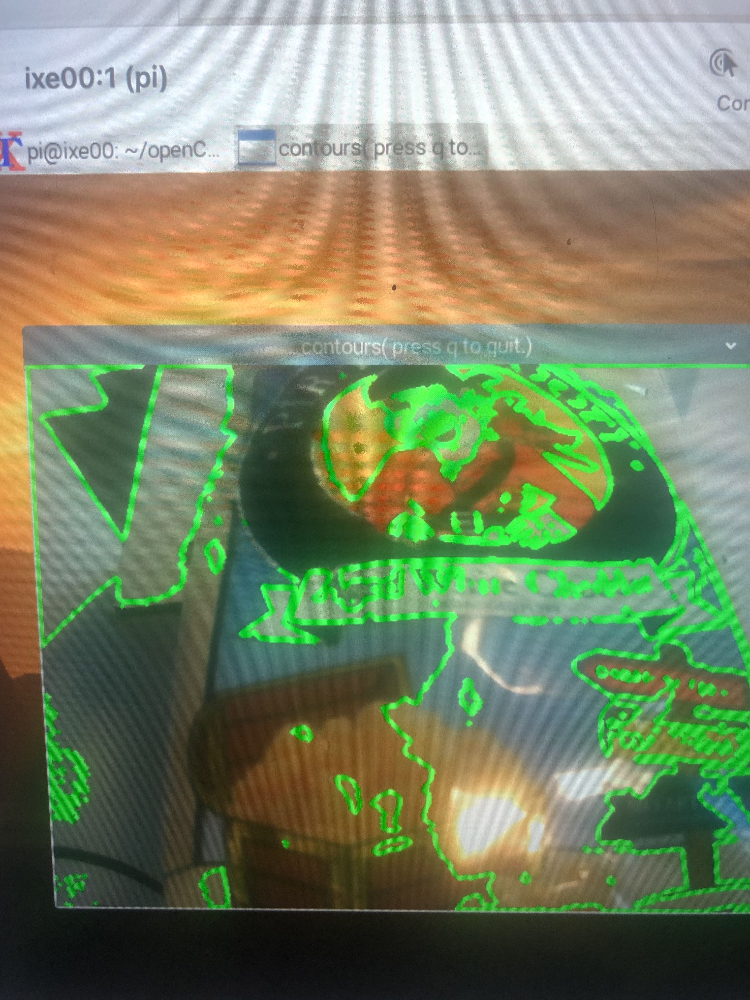 
</p>


**Face Detection**
This algorithm focuses on encapuslating the various key features of a face to identify the boundary boxes to help categorization.

One application is to use it to consider identifying when someone is happy or when someone is sad. For example, I used it to identify faces that were happy and sad below. You can train and recognize overtime that the contours and direction the corners of the eyes and mouth are pulled in can help you detect when the person is sad or happy. It is very difficult to stage "happiness" in the eyes for example, so we coudl train this data overtime to undestand what contour directions determine mood. Thsi woudl be handy in a "smartmirror" like device, which the participant could look in at morning preparation time and it can then be configured to take a mood altering action with sound or lighting effects.

_Example Image of Test_
<p float="left">
  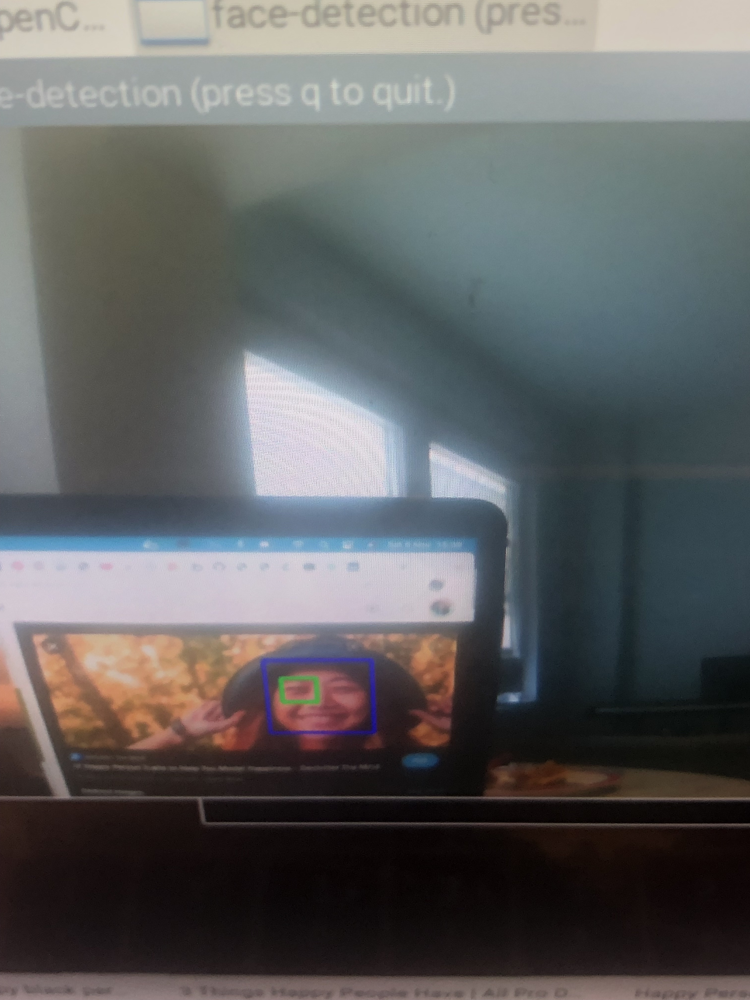
  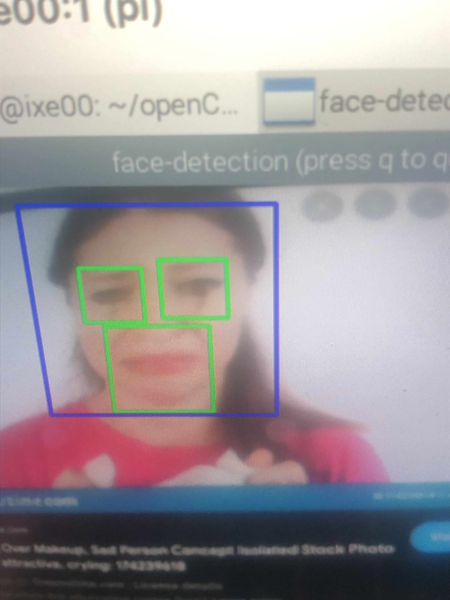 
    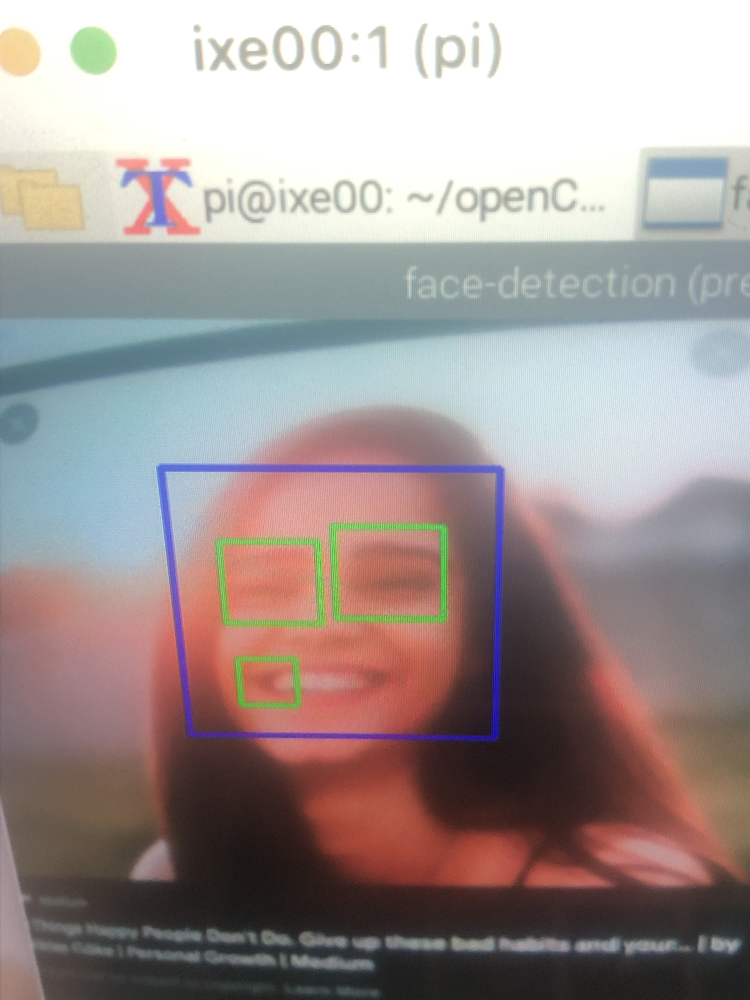 

</p>

**Flow Detection**
This algorithm focuses on identifying starting points from which it expects to map a directional visual flow.

A fun application could be a game of "X" and "O"s.  I tried to replicate this but have not quite mastered it yet! :-)

_Example Image of Test_

<p float="left">
  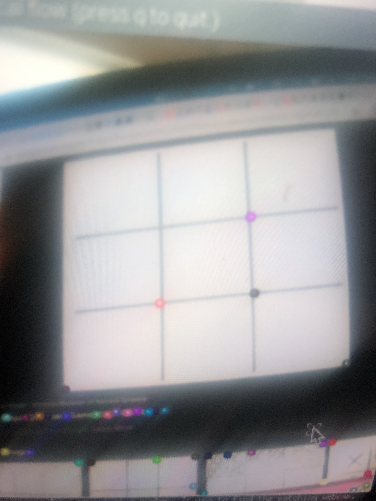
  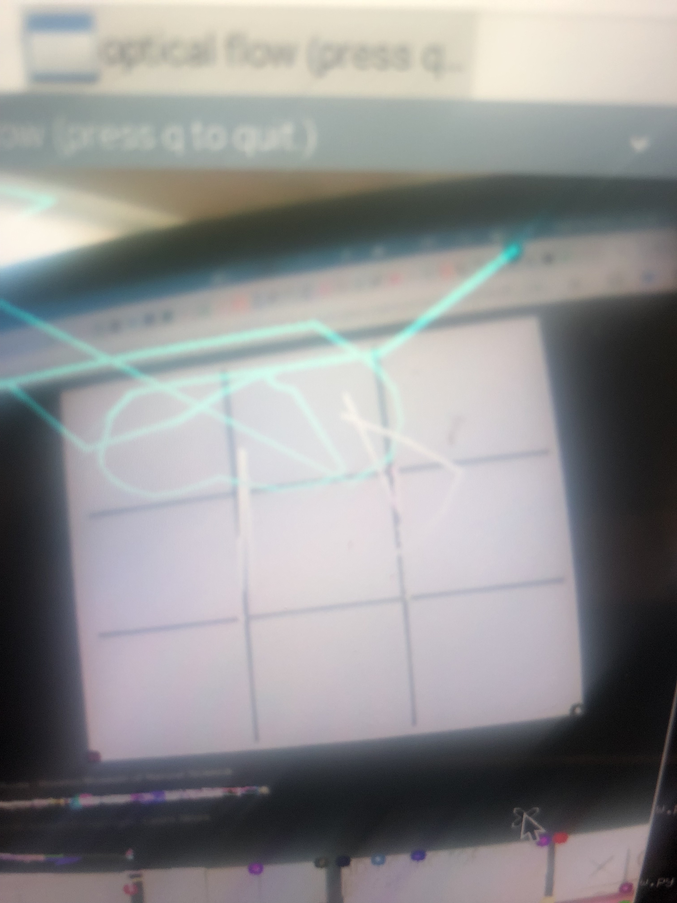 
    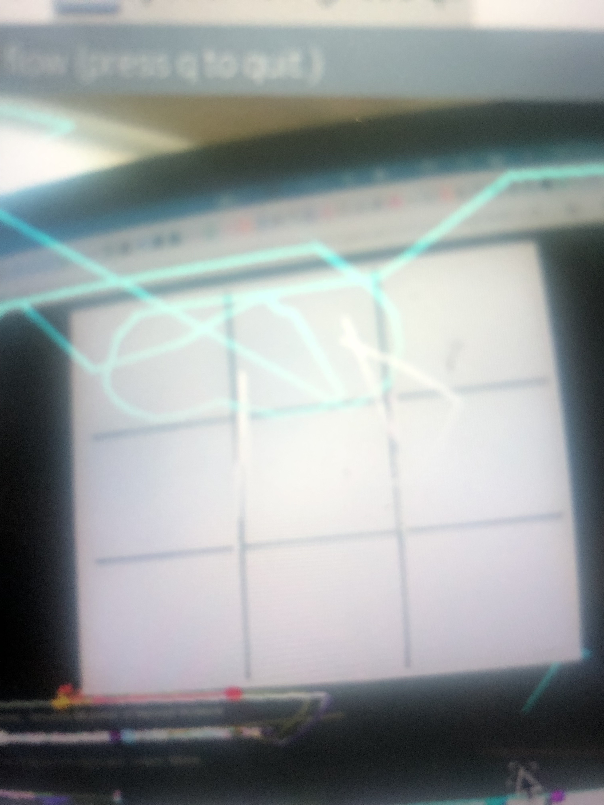 

</p>

**Object Detection**
This algorithm focuses on identifying boudnaries of objects within its frame.

A fun application could also be a game of "Where is wally?" and you could try to identify where in the image he is once you have fed the algorithm an image of what wally looks like.

_Example Image of Test_

<p float="left">
  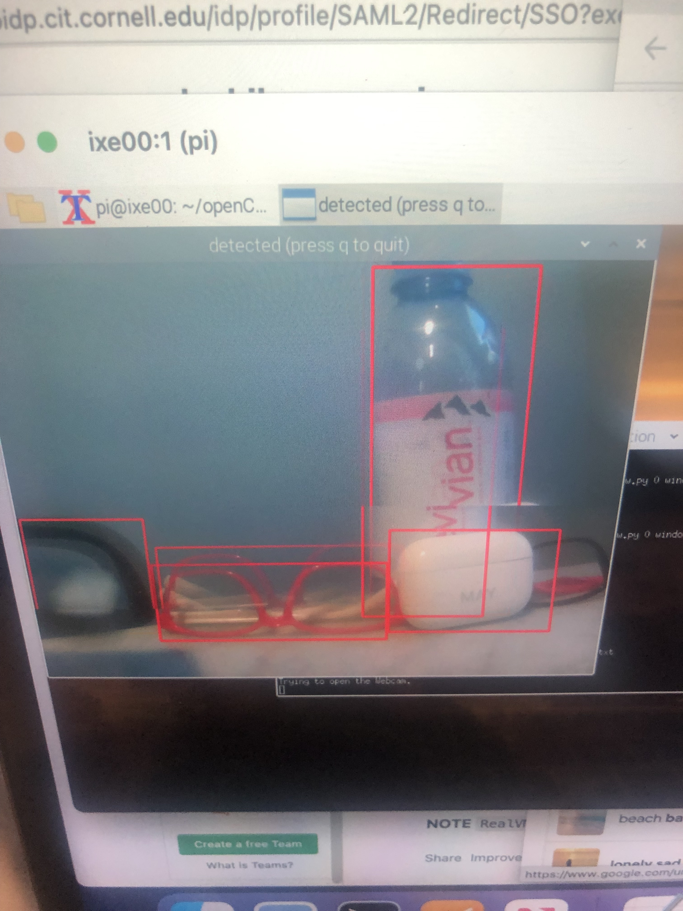

</p>

#### MediaPipe

A more recent open source and efficient method of extracting information from video streams comes out of Google's [MediaPipe](https://mediapipe.dev/), which offers state of the art face, face mesh, hand pose, and body pose detection.


To get started, create a new virtual environment with special indication this time:

```
pi@ixe00:~ $ virtualenv mpipe --system-site-packages
pi@ixe00:~ $ source mpipe/bin/activate
(mpipe) pi@ixe00:~ $ 
```

and install the following.

```
...
(mpipe) pi@ixe00:~ $ sudo apt install ffmpeg python3-opencv
(mpipe) pi@ixe00:~ $ sudo apt install libxcb-shm0 libcdio-paranoia-dev libsdl2-2.0-0 libxv1  libtheora0 libva-drm2 libva-x11-2 libvdpau1 libharfbuzz0b libbluray2 libatlas-base-dev libhdf5-103 libgtk-3-0 libdc1394-22 libopenexr23
(mpipe) pi@ixe00:~ $ pip3 install mediapipe-rpi4 pyalsaaudio
```

Each of the installs will take a while, please be patient. After successfully installing mediapipe, connect your webcam to your Pi and use **VNC to access to your Pi**, open the terminal, and go to Lab 5 folder and run the hand pose detection script we provide:
(***it will not work if you use ssh from your laptop***)


```
(mpipe) pi@ixe00:~ $ cd Interactive-Lab-Hub/Lab\ 5
(mpipe) pi@ixe00:~ Interactive-Lab-Hub/Lab 5 $ python hand_pose.py
```

Try the two main features of this script: 1) pinching for percentage control, and 2) "[Quiet Coyote](https://www.youtube.com/watch?v=qsKlNVpY7zg)" for instant percentage setting. Notice how this example uses hardcoded positions and relates those positions with a desired set of events, in `hand_pose.py` lines 48-53. 

**\*\*\*Consider how you might use this position based approach to create an interaction, and write how you might use it on either face, hand or body pose tracking.\*\*\***

<<<<<<< HEAD
<<<<<<< HEAD
_Example Image of Test_

<p float="left">
  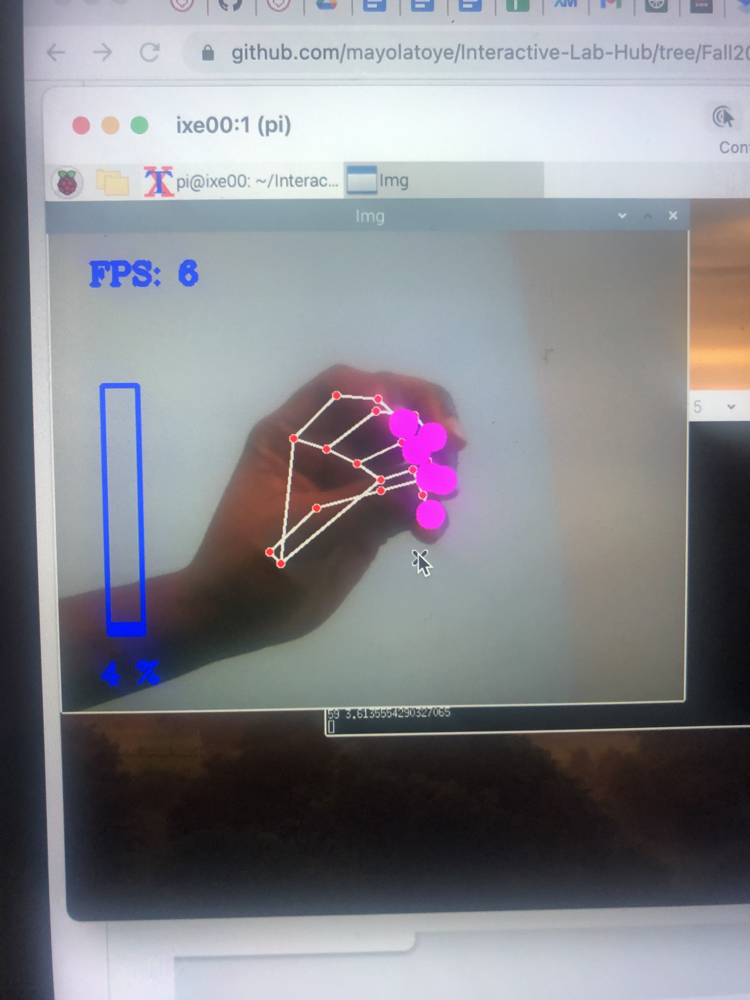
    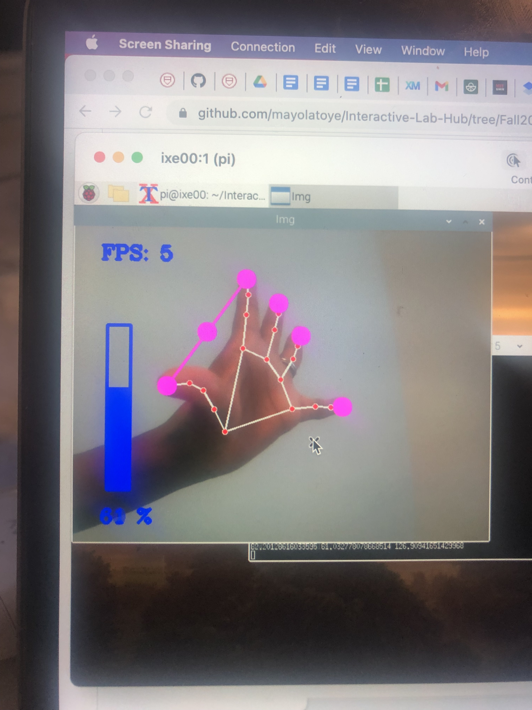

</p>
<p float="left">
  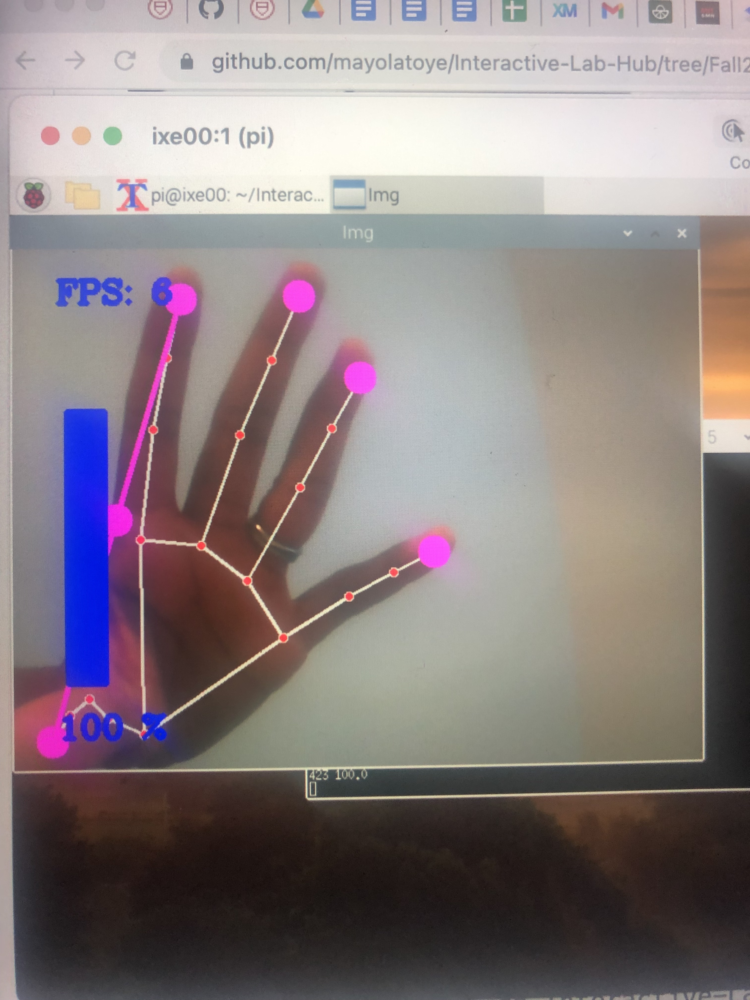
    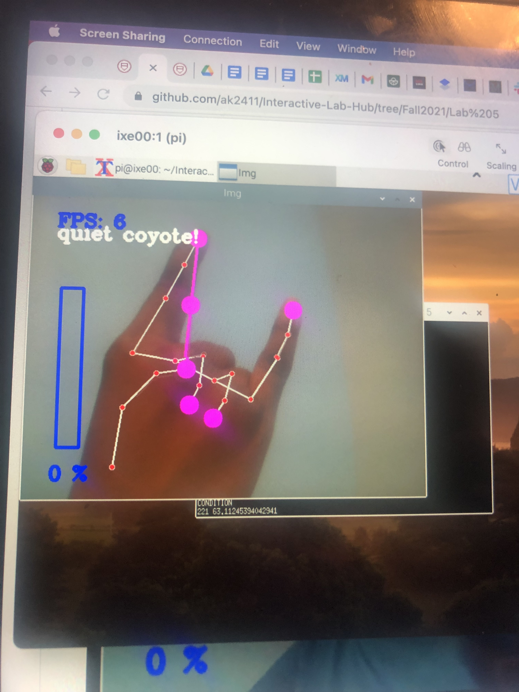

</p>


(You might also consider how this notion of percentage control with hand tracking might be used in some of the physical UI you may have experimented with in the last lab, for instance in controlling a servo or rotary encoder.)

You could utilize the various signs within a sign lanaguge application. You can also connect them to voice so that the interpretations could be linked to certain words and re-purposed conent shown in audio format for those who have an auditory prefence over sign language preference.

Another application could be to call the elevator in a building. Perhaps instead of talking, you can make a visual gesture of the floor number you wish to go to. The screen can re-affirm this interaction by showing a visual representation of the number you jsut "signed", and you can also accept visual cues like a thumbs up or implict cues like a nod of the head.

(You might also consider how this notion of percentage control with hand tracking might be used in some of the physical UI you may have experimented with in the last lab, for instance in controlling a servo or rotary encoder.)

(You might also consider how this notion of percentage control with hand tracking might be used in some of the physical UI you may have experimented with in the last lab, for instance in controlling a servo or rotary encoder.)


#### Teachable Machines
Google's [TeachableMachines](https://teachablemachine.withgoogle.com/train) might look very simple. However, its simplicity is very useful for experimenting with the capabilities of this technology.


To get started, create and activate a new virtual environment for this exercise with special indication:

```
pi@ixe00:~ $ virtualenv tmachine --system-site-packages
pi@ixe00:~ $ source tmachine/bin/activate
(tmachine) pi@ixe00:~ $ 
```

After activating the virtual environment, install the requisite TensorFlow libraries by running the following lines:
```
(tmachine) pi@ixe00:~ $ cd Interactive-Lab-Hub/Lab\ 5
(tmachine) pi@ixe00:~ Interactive-Lab-Hub/Lab 5 $ sudo chmod +x ./teachable_machines.sh
(tmachine) pi@ixe00:~ Interactive-Lab-Hub/Lab 5 $ ./teachable_machines.sh
``` 

This might take a while to get fully installed. After installation, connect your webcam to your Pi and use **VNC to access to your Pi**, open the terminal, and go to Lab 5 folder and run the example script:
(***it will not work if you use ssh from your laptop***)

```
(tmachine) pi@ixe00:~ Interactive-Lab-Hub/Lab 5 $ python tm_ppe_detection.py
```


(**Optionally**: You can train your own model, too. First, visit [TeachableMachines](https://teachablemachine.withgoogle.com/train), select Image Project and Standard model. Second, use the webcam on your computer to train a model. For each class try to have over 50 samples, and consider adding a background class where you have nothing in view so the model is trained to know that this is the background. Then create classes based on what you want the model to classify. Lastly, preview and iterate, or export your model as a 'Tensorflow' model, and select 'Keras'. You will find an '.h5' file and a 'labels.txt' file. These are included in this labs 'teachable_machines' folder, to make the PPE model you used earlier. You can make your own folder or replace these to make your own classifier.)

**\*\*\*Whether you make your own model or not, include screenshots of your use of Teachable Machines, and write how you might use this to create your own classifier. Include what different affordances this method brings, compared to the OpenCV or MediaPipe options.\*\*\***

_My Experience_

So I made a mask and tried to run to see if it coudl distinguish between my face - no mask, mask and the background.

It did better at "no mask" but had problems classifying me with a mask on because sometimes it thought I was a background. I am wondering if maybe it is not trained well enough on black melanted skin.

The interface is a really nice "low-code" way of being able to create a classificaton algorithm.

I can create several classes of objects though images taken directly via the webcam or uploaded. What is also nice is it enourages taking the image from a variety of angles to provide more spectrum to being able to recognize the object perhaps from different angles.

You can then train the model without also havign to worry about tunning hyperparameters like the number of epochs for example. 

You are then able to download the model you have fully trained.

It would be great to use this as a classifer to identify objects that may be considered 'messy" in a room. If it finds these objects scattered across the floor, it can send an alert that the room is untidy. You can provide some variability to say if it finds less than 10 objects scattered on the floor, the room is considered "not too messy, but coudl do with some work". In that way you improve the interaction by providing information in a manner that isn't jsut binary e.g. tidy not tidy but closer to how humans would interact in language of expression.  

_Example Image of Test_

<p float="left">
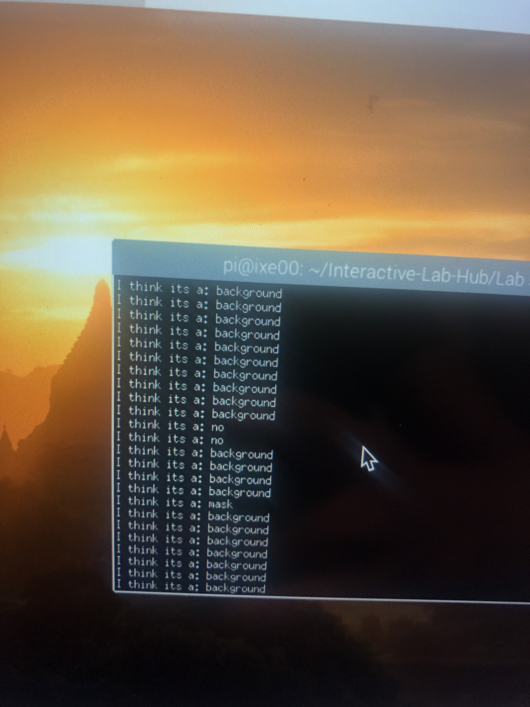
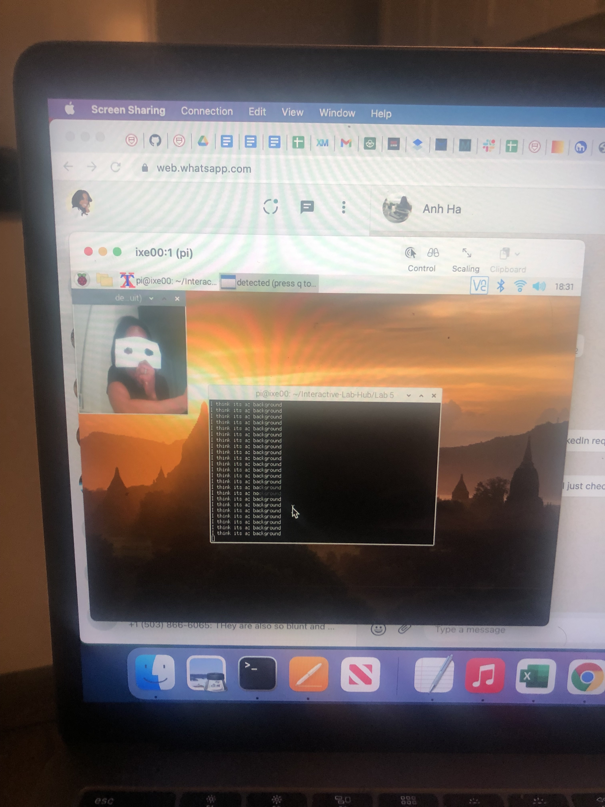
</p>
<p float="left">
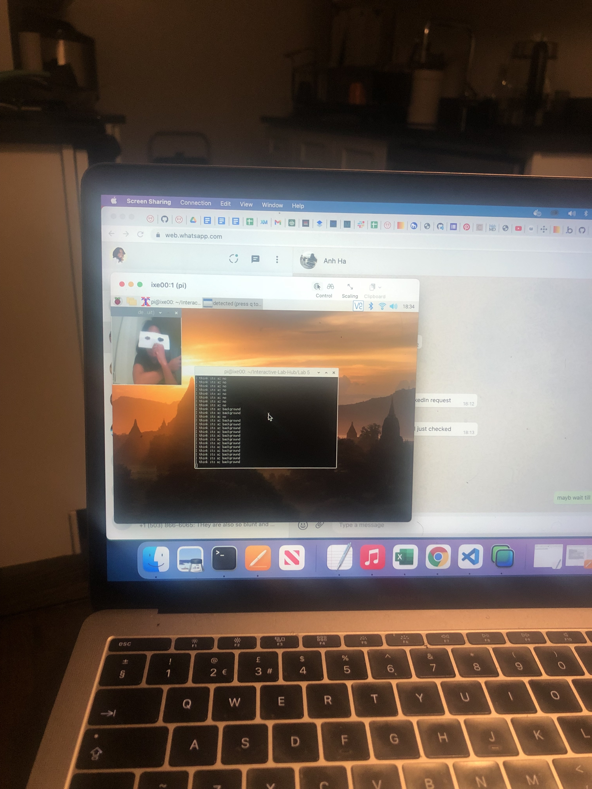
 
</p>

*Don't forget to run ```deactivate``` to end the Teachable Machines demo, and to reactivate with ```source tmachine/bin/activate``` when you want to use it again.*


#### Filtering, FFTs, and Time Series data. (optional)
Additional filtering and analysis can be done on the sensors that were provided in the kit. For example, running a Fast Fourier Transform over the IMU data stream could create a simple activity classifier between walking, running, and standing.

Using the accelerometer, try the following:

**1. Set up threshold detection** Can you identify when a signal goes above certain fixed values?

**2. Set up averaging** Can you average your signal in N-sample blocks? N-sample running average?

**3. Set up peak detection** Can you identify when your signal reaches a peak and then goes down?

**\*\*\*Include links to your code here, and put the code for these in your repo--they will come in handy later.\*\*\***


### Part B
### Construct a simple interaction.

Pick one of the models you have tried, pick a class of objects, and experiment with prototyping an interaction.
This can be as simple as the boat detector earlier.
Try out different interaction outputs and inputs.

**\*\*\*Describe and detail the interaction, as well as your experimentation here.\*\*\***

I will be using the Teachable Machines classification model.

The class labels will be:
0 - Background
1 - Moderately Tidy
2 - Very Untidy

The class of objects will contain books, toys and clothes.

_Example of Teachable Machines Training Process_
<p float="left">
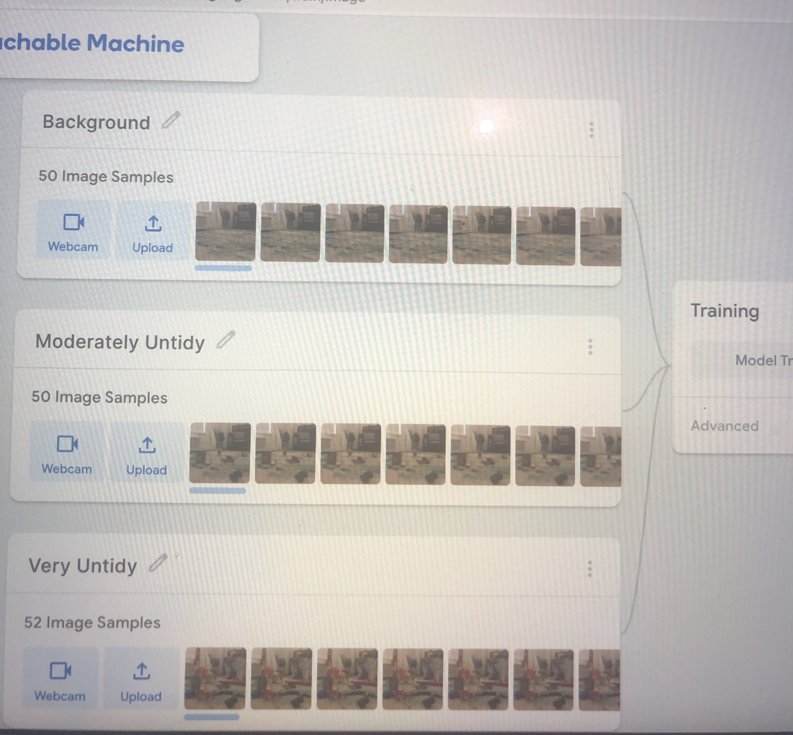
</p>


The interaction I wish to prototype is displayed in the Venplak diagram below. Simply,  JibberChatter will watch the child's room continously. 


_Sceanrio_
When the room becomes untidy with books/clothing/toys on the floor it will send a voice alert through the home calling them out.  There are two classes of untidiness it looks out for, moderate untidiness to which it gives out more of a voice warning and lots more untidiness to which it gives a stronger voice warning.  

A further enhancement building on [Lab 3](https://github.com/mayolatoye/Interactive-Lab-Hub/tree/Fall2021/Lab%203) can involve waiting to hear a voice acknowledgement that the children will accept the request to tidy up. The device can escalate consequential actions such as "I will lock your ipad devices for  hours" to "I will send a push notifcation to your mother at work to let her know you are on listening".


**Verplank diagram**

[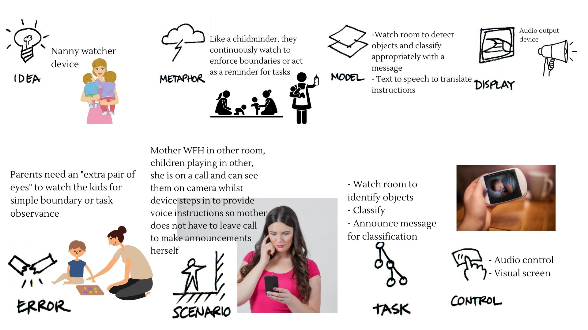](JibberChatterWatches.jpg)


### Part C
### Test the interaction prototype

Now flight test your interactive prototype and **note down your observations**:

For example:
1. When does it what it is supposed to do?

_It understands clearly when the room is empty and tidy, the delineation between moderately untidy and very untidy can be more diffficult to reach. I suspect with more training samples this would improve._

2. When does it fail?

_It fails sometimes when it thinks the room has become moderately tidy, then say I walk past to add another object, it assumes a solid background i.e. a person and not "many" objects to detect but that one person is _"like"_ the background which denotes an empty room in the curent messaging interaction.

3. When it fails, why does it fail?

_Response given above. To expand further, I think if I trained it with samples of people in the various class conexts as well, it would probably run into this issue less frequently. i also saw it struggles with "moving toys" and possibly "moving humans". See example video below._

**When It Breaks**
***
[](https://youtu.be/vEewWRtFOaE)
***


4. Based on the behavior you have seen, what other scenarios could cause problems?

_The other scenarios that could cause problems is when childen are actively playing within the setting. With constant movement and toys being brought in and out, it may get confussed and fail more frequently because it does not understand what the people are especially if there are several children playing or lots of moving toys like electric trains on a track. It would also be less effective if it does not understand the difference between "play" and "mess"._

**\*\*\*Think about someone using the system. Describe how you think this will work.\*\*\***
1. Are they aware of the uncertainties in the system?

_I imagine a person using this would not be initially aware of the issue of not distinguising when children are just playing or the room is actually clear and empty. The voice message also does not actually capture "play" but it does offer some neutrality in that "there is nothing to report"_

2. How bad would they be impacted by a miss classification?

_The problem however would stem from when the system finally stabilizes to a point where the children are playing with so many toys or "objects" it starts to send alerts the room is really untidy when in fact they are just playing with "lots of objects"._

3. How could change your interactive system to address this?

_I would add more training data to incorpoate adults **and** children. I would also make sure this data shows various situational poses in particular to capture the movement of children playing, and playing **with** the toys, including toys with movement in order for it to be able to distinguish more easily the act of "play" from "mess"._

4. Are there optimizations you can try to do on your sense-making algorithm.

_Yes. You can focus more on motion detection, if they are running too much within a closed space you may want to make a voice alert to usher them to stop. You could also explore some further face detection to see if they look to be a in a good mood or not based on the contours around the eyes and mouth. Another angle could be using flow direction to check they are not going near areas like windows._

For example:
1. When does it what it is supposed to do?
1. When does it fail?
1. When it fails, why does it fail?
1. Based on the behavior you have seen, what other scenarios could cause problems?

**\*\*\*Think about someone using the system. Describe how you think this will work.\*\*\***
1. Are they aware of the uncertainties in the system?
1. How bad would they be impacted by a miss classification?
1. How could change your interactive system to address this?
1. Are there optimizations you can try to do on your sense-making algorithm.

### Part D
### Characterize your own Observant system

Now that you have experimented with one or more of these sense-making systems **characterize their behavior**.
During the lecture, we mentioned questions to help characterize a material:
* What can you use X for?

The JibberChatter device can be used as an additional "pair of eyes" like a cost-effcient virtual babysitter **compliment** not substitute!

She can interact with them through simple voice commands when tasks like tidying up needs to be done and when they should be done for. 

* What is a good environment for X?

A good environment for JibberChatter in this scenario setting is for "stay at home" mothers or home schooling children. It works better in limited or confined spaces it can learn and control better the boundaries of interactions. It can provide an acoompanied producivity boost with its simple reminders and warnings.

* What is a bad environment for X?

A bad environment could be one with multiple objects or persons it is unfamiliar with. So a government office for example where people are coming in and out queing for various things that are always changing in style/motion.

* When will X break?

JibberChatter "breaks" in this setting if the camera cannot capture the correct perspective within the room. I actually ran into this issue a few times and it took so long to capture a full length film because sometimes the system was simply unable to open the WebCam, so without any line of vision either through technical difficulty or a human "moves" the devices viewpoint to say a window seal, it will become useless in its output or simply breakdown and close like it did for me.

* When it breaks how will X break?

If it breaks technicaly, it simply shuts down the entire system. If it breaks because of human intervention changing its purview it will just output redundant irrelevant messages most likely about the background eg. say its placed along a wall or turned away.

I tried to also break it by running an experiment to change the room it was trained in. I was unable to break it! It still understood when the room was clear, moderately untidy and also very untidy.

**Change The Room To Break It**
***
[](https://youtu.be/1PAjivpFmKU)
***

* What are other properties/behaviors of X?

JibberChatter could be characterized to sound more like a familiar voice of the child, or even more like an actual child. This could impact how the child responds to the commands overtime and in some cases may improve their response. Given more time, I intended to connect JibberChatter to other devices such as a smart tv or ipad device. So if an action was not taken she could switch it off automatically or switch it on if the right action she proposed was taken. Sort of like a rewards vs consequence system.

* How does X feel?

JibberChatter feels like an "aunty". A helper around the home to assist and make things more productive but also provide guidance when people are stepping out of line.

**\*\*\*Include a short video demonstrating the answers to these questions.\*\*\*** 


* What is a good environment for X?
* What is a bad environment for X?
* When will X break?
* When it breaks how will X break?
* What are other properties/behaviors of X?
* How does X feel?

**\*\*\*Include a short video demonstrating the answers to these questions.\*\*\***

### Part 2.

Following exploration and reflection from Part 1, finish building your interactive system, and demonstrate it in use with a video.

**\*\*\*Include a short video demonstrating the finished result.\*\*\***

***
[](https://youtu.be/Pp4G0JH3lPQ)
***


You can also watch JibberChatter monitor the room in a different setting from where she was trained and also show the "reverse clean up duty" to get back to a tidy room here. 

**Reverse Clean**
***
[](https://youtu.be/R8vOhT0UZQ0)
***

**System Control View**
***
[](https://youtu.be/XFi1gk4lIos)
***

_System Control View_
<p float="left">
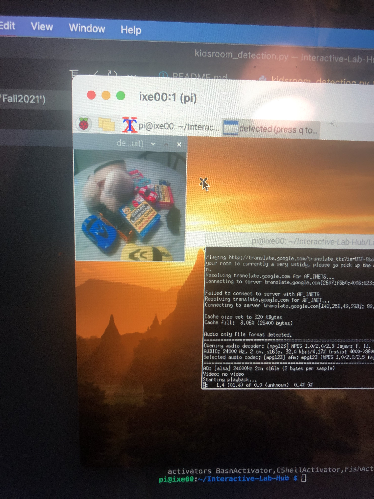
</p>

**No children were used as actors as it was always past their bedtime when I ran my testing and breaking experiments! 🛏️ 🌙**